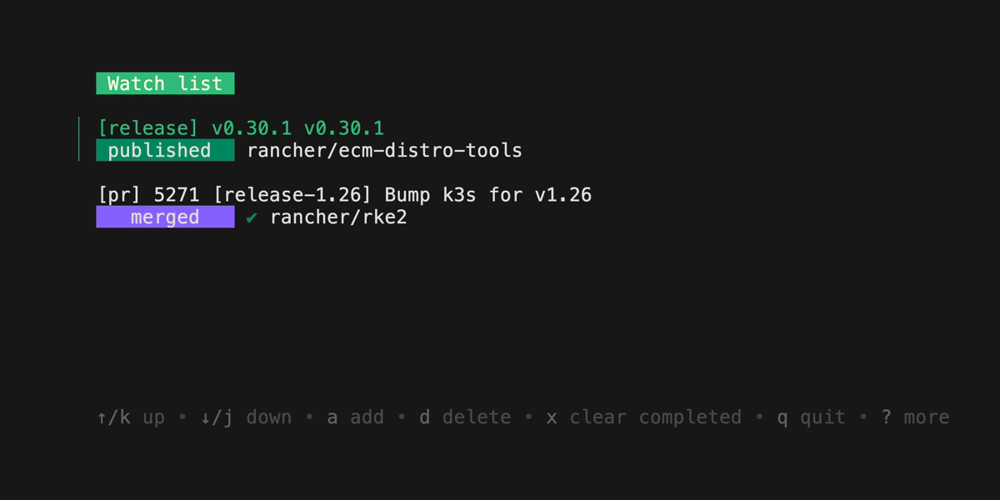

# release

Utility to do K3s and RKE2 releases.

### Examples

```sh
release -h
```

### K3s Release
#### Requirements
* OS: Linux, macOS
* Docker
* Git
* Go (At least the version used upstream for kubernetes)
* Sed (GNU for Linux or BSD for macOS)
* All commands require a Github token (classic) with the following permissions:
  * Be generated on behalf of an account with access to the `k3s-io/k3s` repo
  * `repo`
  * `write:packages`    
* An SSH key, follow the Github [Documentation](https://docs.github.com/en/authentication/connecting-to-github-with-ssh) to generate one.
* A valid config file at `~/.ecm-distro-tools/config.json`

#### Commands
```bash
release generate k3s tags v1.29.2
release push k3s tags v1.29.2
release update k3s references v1.29.2
release tag k3s rc v1.29.2
release tag k3s ga v1.29.2
release watch
```

#### Cache Permissions and Docker:
```bash
$ release generate k3s tags v1.26.12
> failed to rebase and create tags: chown: changing ownership of '/home/go/.cache': Operation not permitted
failed to initialize build cache at /home/go/.cache: mkdir /home/go/.cache/00: permission denied 
```
Verify if the `$GOPATH/.cache` directory is owned by the same user that is running the command. If not, change the ownership of the directory:
```bash
$ ls -la $GOPATH/
> drwxr-xr-x  2 root root 4096 Dec 20 15:50 .cache
$ sudo chown $USER $GOPATH/.cache
```

### watch
watch polls for updates to Drone builds and to GitHub releases and pull requests you select.



## Contributions

* File Issue with details of the problem, feature request, etc.
* Submit a pull request and include details of what problem or feature the code is solving or implementing.
