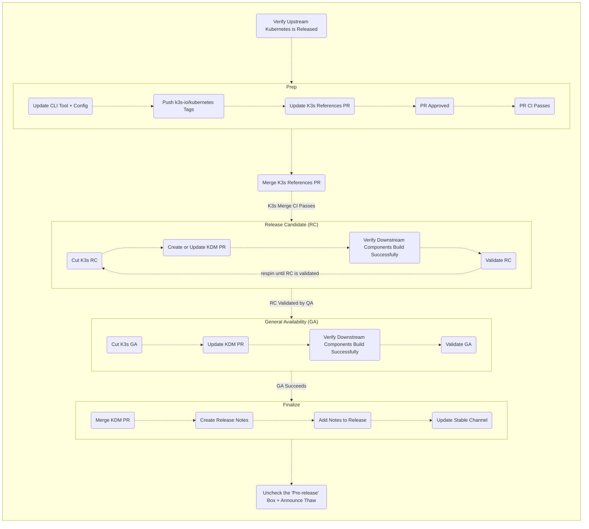

# K3s Release Process

This document serves as a checklist for releasing K3s.

Consider this a checklist for K3s release; it is a skeleton to remind engineers who have done this before what order the steps should be taken.
There are lots of context and notes that are left out of this version, please make sure you understand how to release before using this tool.
Please see "Releasing K3s Explained" for more information.

[How to use the `release` CLI tool](https://github.com/rancher/ecm-distro-tools)

## Verify Upstream Kubernetes is Released

<details><summary>Details</summary>

1. Verify Release
   * Check `#discuss-k3s-rke2-channel` for scheduled upstream patch releases (enable notifications so you don't miss updates).
</details>

## Prep Release

### Update your CLI Tool and Config

<details><summary>Details</summary>

1. Check your local `release` CLI version
   ```shell
   ➜  ~ release --version
   ```
   If it's not current, download the latest release from https://github.com/rancher/ecm-distro-tools/releases. If it prints `release version development`, pull the latest tag and rebuild the binary.
1. Check your GitHub Token, in order of priority:
   1. `~/.ecm-distro-tools/config.json`, the `auth.github_token` field.
   1. Environment variable `GITHUB_TOKEN`.
   1. If neither is set, set at least one.
1. Update `~/.ecm-distro-tools/config.json`, filling `k3s.versions` with an entry for each new incoming patch:
   ```json
   {
     "k3s": {
       "versions": {
         "v1.36.3": {
           "old_k8s_version": "v1.36.2",
           "new_k8s_version": "v1.36.3",
           "old_k8s_client": "v0.36.2",
           "new_k8s_client": "v0.36.3",
           "old_suffix": "k3s1",
           "new_suffix": "k3s1",
           "release_branch": "release-1.36",
           "workspace": "/home/rafa/go/src/github.com/k3s-io",
           "k3s_repo_owner": "k3s-io",
           "system_agent_installer_repo_owner": "rancher",
           "k8s_rancher_url": "git@github.com:k3s-io/kubernetes.git",
           "k3s_upstream_url": "git@github.com:k3s-io/k3s.git",
           "dry_run": false
         }
       }
     }
   }
   ```
   Update `old_k8s_version`, `new_k8s_version`, `old_k8s_client`, `new_k8s_client`, `old_suffix`, `new_suffix`, and `release_branch` accordingly. For a new minor release (e.g. `v1.37.0`), add a new entry the same way, but set `old_k8s_version` and `old_k8s_client` to the previous minor's `.3` or `.4` patch, this only affects release notes generation.
</details>

### Push `k3s-io/kubernetes` Tags

<details><summary>Details</summary>

This is a required step before opening the reference PRs.

1. Generate and push the tags:
   ```shell
   release generate k3s tags v1.33.13
   release push k3s tags v1.33.13
   ```
1. Common errors:
   * `error: failed to push some refs to ... 403`, check your GitHub Token, it may be expired or revoked.
   * `error: failed to push some refs to ... 429`, GitHub API rate limit, wait a while and try again.
   * `go: example.com imports example.com: cannot find module providing package example.com`, upstream may not have created the tags yet for all libraries; wait and retry. This happens often with `k8s.io/cri-client`, check whether the tag exists upstream: https://github.com/kubernetes/cri-client
</details>

### Update K3s References

<details><summary>Details</summary>

Before you start, make sure all `k3s-io/kubernetes` tags for this cycle have been pushed (previous step), that step is required for opening these PRs.

- **Automated CI (experimental)**:
    - trigger [Updatecli: k3s-io/kubernetes Dependency and Go Bumps](https://github.com/k3s-io/k3s/actions/workflows/updatecli_k8s.yaml). 
    - Still in testing; it may not work as expected, in which case fall back to opening the PRs running the command locally.

- **Automated Local**, with your config file updated, run:
   ```shell
   release update k3s references v1.33.13
   ```
   This opens a PR (e.g. [[release-1.36] Bump k3s-io/kubernetes and Go references](https://github.com/k3s-io/k3s/pull/14456)) covering:
   1. `Dockerfile`, `Dockerfile.manifest`, and `Dockerfile.test`
      1. `ARG GOLANG=golang:1.26.5-alpine3.24` updated to the new Go version.
   1. `go.mod` and `go.sum`
      1. `go <go_version>` updated to the upstream Go version.
      1. All `k8s.io/* => github.com/k3s-io/kubernetes/* v<kubernetes_version>-k3sN` entries updated.
- **Manual**: open the PR yourself, following the same checklist above, targeting `release-<k8s_minor_version>` (e.g. `release-1.36`).

Once the PR gets 2 approvals, merge it
</details>

## Create K3s Release Candidate (RC)

### Cut K3s Release

<details><summary>Details</summary>

Before tagging, double check that:
* The release branches are updated with the new `k3s-io/kubernetes` libraries and Go version.
* You've pinged `@k3s-rke2-team` about anything pending, and checked [open PRs](https://github.com/k3s-io/k3s/pulls).

- **Automated**, for each new patch release:
   ```shell
   release tag k3s rc v1.33.13
   ```
   Check the [Release Workflow](https://github.com/k3s-io/k3s/actions/workflows/release.yml).
- **Manual**, tag following `v<k8s_version>-rcN+k3s1`, e.g. `v1.36.3-rc1+k3s1`. `N` starts at `1`.
</details>

### Create or Update KDM PR

<details><summary>Details</summary>

1. Fork `rancher/kontainer-driver-metadata`, branch off each active dev branch. As of this writing:
   * `dev-v2.15`
   * `dev-v2.14`
   * `dev-v2.13`
   * `dev-v2.12`
1. Manually add the entries for the new RCs to `channels.yaml`, following the existing structure.
1. Regenerate derived assets:
   ```shell
   go generate
   ```
1. Commit the changes and open a PR per branch. Suggested structure:
   * one commit for `channels.yaml`, one commit for the generated assets.
   * PR title format: `[<dev-branch>] k3s <Month> patch`
</details>

### Verify Downstream Components Build Successfully

<details><summary>Details</summary>

1. Validate that CIs pass for:
   * system-agent-installer-k3s
     * [Repository](https://github.com/rancher/system-agent-installer-k3s)
     * Not triggered directly by the release workflow, this repo has a polling job that checks for new releases; it can also be triggered manually via [Watch K3s Releases](https://github.com/rancher/system-agent-installer-k3s/actions/workflows/watch-k3s-releases.yml).
   * k3s-upgrade
     * [Repository](https://github.com/k3s-io/k3s-upgrade)

   Known errors:
   * `Publish Image` step fails installing `slsactl` (`invalid version: unknown revision null`), flaky, re-run the workflow.
</details>

### Validate RC

<details><summary>Details</summary>

1. Share the RCs with QA, start a thread in `#discuss-k3s-rke2-channel`:
   ```
   RCs cut:

   - v1.33.13-rc5+k3s2
   - v1.34.10-rc4+k3s1
   - v1.35.7-rc4+k3s1
   - v1.36.3-rc4+k3s1


   KDM PRs updated:

   - [dev-v2.15] k3s July patch
   - [dev-v2.14] k3s July patch
   - [dev-v2.13] k3s July patch
   - [dev-v2.12] k3s July patch

   cc: @k3s-rke2-qa @Caroline O'Hara @Chris Wayne
   ```
1. Look for the QA validation report
</details>

## Prep R2

<details><summary>Details</summary>

1. Follow [the release candidate steps](#create-k3s-release-candidate-rc) again, the `release tag k3s rc` command automatically increments the RC number, and the process is otherwise identical.
1. Updating KDM is manual for every round: update each entry and commit, remembering `go generate`. There's no automated alternative for k3s currently.
1. **Note:** a suffix bump (e.g. `k3s1` to `k3s2`) should be treated as the exception, not the default, it means a real bug made it past RC into GA. Confirm with `@k3s-rke2-team` before committing to it, since it fans back out into every downstream step a second time.
</details>

## Cut K3s GA Release

<details><summary>Details</summary>

Before cutting GAs, make sure all KDM PRs are passing CI, a KDM PR failure has previously slipped through with GAs already cut, shipping a bug that required a `k3s2` release to fix.

1. **Automated**:
   ```shell
   release tag k3s ga v1.33.13
   ```
   Run once per patch. The same CI and downstream component verification from the RC process applies.
1. **Manual**, tag as with an RC, but omit the `-rcN` part, e.g. `v1.36.3+k3s1`.
</details>

**NOTE** Once the GA tags are created, the KDM PR, Release Notes, and Channel Server steps can all be done/should be done in tandem with one another.

## Finalize Release

### Merge KDM PR

<details><summary>Details</summary>

1. Update the KDM PRs with the new GAs, a simple find/replace removing `-rcN` from `channels.yaml` works. Remember `go generate`.
1. Get the proper approvals
1. Make sure CI passes
1. Make sure the team is ready
1. Merge KDM PR
</details>

### Create Release Notes

<details><summary>Details</summary>

1. Run the update command, once per branch:
   ```shell
   release generate k3s release-notes --milestone v1.36.2+k3s1 --prev-milestone v1.36.1+k3s2 > k3s/v1.36.md
   release generate k3s release-notes --milestone v1.35.6+k3s1 --prev-milestone v1.35.5+k3s2 > k3s/v1.35.md
   release generate k3s release-notes --milestone v1.34.9+k3s1 --prev-milestone v1.34.8+k3s2 > k3s/v1.34.md
   release generate k3s release-notes --milestone v1.33.13+k3s1 --prev-milestone v1.33.12+k3s2 > k3s/v1.33.md
   ```
   (Clone `rancherlabs/release-notes` and branch for this release cycle first.)
1. Copy the generated release notes
1. Validate and update the release notes as necessary (typos, spacing, lists)
1. Get PR approval
1. Merge PR, note the merge itself should only happen after the GAs' pre-release checkbox is unchecked, so this PR can sit open for a bit
1. Copy notes into the GitHub Release page, **keep the release in pre-release**; unchecking `Pre-release` is the last step of the whole process
</details>

### Update Stable Channel

<details><summary>Details</summary>

1. Edit the `channels.yaml` file in the [K3s repo](https://github.com/k3s-io/k3s) (`main` branch only):
   ```yaml
   channels:
   - name: stable
     latest: v1.32.3+k3s1 # This Line
   ```
   - If a new minor version is released, you will also need to add a new entry for it, e.g.:
   ```yaml
   - name: v1.36
     latestRegexp: v1\.36\..*
     excludeRegexp: ^[^+]+-
   ```
1. Only bump the minor version if the patch is `.2` or `.3`, ping k3s developers and managers first to confirm.
1. Get PR approval, this PR should only merge after the GAs' pre-release checkbox is unchecked
</details>

## Uncheck the Pre-release Checkbox

<details><summary>Details</summary>

1. After the GAs are validated by QA, go to the GA releases, edit them, and uncheck the "Pre-release" checkbox. The highest minor version becomes "latest."
1. Announce the thaw in `#discuss-k3s-rke2-channel`:
   ```
   Release notes pasted in, KDM PRs and Channel Server PR merged and pre-release unchecked.

   k3s release is finished, and the branches 1.33~1.36 are now unfrozen.

   cc: @Caroline O'Hara @Chris Wayne
   ```
</details>

## Flowchart


