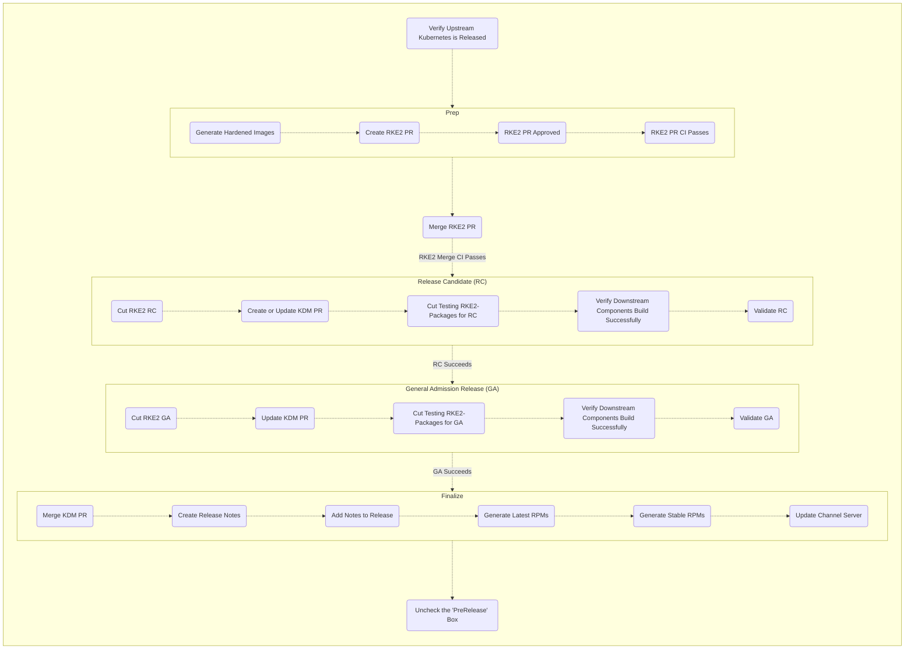

# RKE2 Release Process

This document serves as a checklist for releasing RKE2.

Consider this a checklist for RKE2 release; it is a skeleton to remind engineers who have done this before what order the steps should be taken.
There are lots of context and notes that are left out of this version, please make sure you understand how to release before using this tool.
Please see "[Releasing RKE2 Explained](./releasing_rke2_explained.md)" for more information.

[How to use tools](./releasing_rke2_explained.md#tools)

## Verify Upstream Kubernetes is Released

<details><summary>Details</summary>

1. Verify Release
   ```shell
   export K8S_RELEASES='v1.21.14 v1.22.11 v1.23.8 v1.24.2'
   alias edt='docker run --rm -it --env GITHUB_TOKEN=$GHT rancher/ecm-distro-tools'
   edt check_for_k8s_release -r "$K8S_RELEASES"
   ```
1. Update release report
</details>

## Prep Release
### Generate Hardened Kubernetes Images

<details><summary>Details</summary>

1. Generate hardened kubernetes
   ```shell
   export K8S_RELEASES='v1.21.14 v1.22.11 v1.23.8 v1.24.2'
   export RKE2_RELEASES='v1.21.14+rke2r1 v1.22.11+rke2r1 v1.23.8+rke2r1 v1.24.2+rke2r1'
   export IMAGE_BUILD_RKE2_RELEASES='v1.21.14-rke2r1 v1.22.11-rke2r1 v1.23.8-rke2r1 v1.24.2-rke2r1'
   alias edt='docker run --rm -it --env GITHUB_TOKEN=$GHT rancher/ecm-distro-tools'
   edt tag_image_build_k8s_release -r "$IMAGE_BUILD_RKE2_RELEASES"
   ```
1. Update release report
</details>

### Update RKE2

<details><summary>Details</summary>

  1. `./Dockerfile`
      1. `FROM rancher/hardened-kubernetes:v1.23.5-rke2r1-build20220217 AS kubernetes`
      1. `RUN CHART_VERSION="v1.21.10-build2021041301" CHART_FILE=/charts/rke2-kube-proxy.yaml`
  1. `./scripts/version.sh`
      1. `KUBERNETES_VERSION=${KUBERNETES_VERSION:-v1.23.5}`
  1. `./go.mod`
  1. `./go.sum`
1. Create a pull request
   * set reviewers to "k3s" group
   * assign to yourself
   * make sure upstream branch is appropriate for PR (eg. `release-1.23` for `june-release-1.23-r1`)
1. [Drone-pr CI](https://drone-pr.rancher.io/rancher/rke2)
1. Once your PR gets 2 approvals and the CI completes successfully, you may merge it
1. [Drone-publish CI](https://drone-publish.rancher.io/rancher/rke2)
1. Update release report
</details>

## Create RKE2 Release Candidate (RC)
### Cut RKE2 Release

<details><summary>Details</summary>

1. Cut RKE2 Release
   ```shell
   export K8S_RELEASES='v1.21.14 v1.22.11 v1.23.8 v1.24.2'
   export RKE2_RELEASES='v1.21.14-rc1+rke2r1 v1.22.11-rc1+rke2r1 v1.23.8-rc1+rke2r1 v1.24.2-rc1+rke2r1'
   export IMAGE_BUILD_RKE2_RELEASES='v1.21.14-rke2r1 v1.22.11-rke2r1 v1.23.8-rke2r1 v1.24.2-rke2r1'
   export MASTER_RELEASE_VERSION='v1.24' # the version represented in the master branch
   alias edt='docker run --rm -it --env GITHUB_TOKEN=$GHT rancher/ecm-distro-tools'
   edt tag_rke2_release -m $MASTER_RELEASE_VERSION "$RKE2_RELEASES"
   ```
1. Update release report
</details>

### Create or Update KDM PR

<details><summary>Details</summary>

1. Update `./channels-rke2.yaml`
   1. Copy the previous version and paste it after itself
   1. Update the version number to the one you want to add
   1. Update the anchors to the new version number
   1. Update the aliases to the previous node
   1. Compare the versions
   1. Overwrite any changes to chart versions from the previous tag
   1. Overwrite any Agent CLI arg changes
   1. Overwrite any Server CLI arg changes
   1. Set the default version
1. Commit change
1. Generate json file
1. Commit change with "go generate" message
1. Create pull request
   * prepend `[WIP]:` to the title of the PR
1. Update release report
</details>

### Cut RKE2-Packaging Release

<details><summary>Details</summary>

1. Cut RKE2-Packaging release
   ```shell
   export K8S_RELEASES='v1.21.14 v1.22.11 v1.23.8 v1.24.2'
   export RKE2_RELEASES='v1.21.14-rc1+rke2r1 v1.22.11-rc1+rke2r1 v1.23.8-rc1+rke2r1 v1.24.2-rc1+rke2r1'
   export IMAGE_BUILD_RKE2_RELEASES='v1.21.14-rke2r1 v1.22.11-rke2r1 v1.23.8-rke2r1 v1.24.2-rke2r1'
   export MASTER_RELEASE_VERSION='v1.24' # the version represented in the master branch
   export RPM_RELEASE_ITERATION=0 # usually 0, but may increment if RPMs need to be re-released
   alias edt='docker run --rm -it --env GITHUB_TOKEN=$GHT rancher/ecm-distro-tools'
   # '-t' is for testing channel, this will change to '-s' for stable, and '-l' for latest
   edt tag_rke2_packaging_release -t -i $RPM_RELEASE_ITERATION -r "$RKE2_RELEASES"
   ```
1. [Drone-publish](https://drone-publish.rancher.io/rancher/rke2-packaging/)
1. Update release report
</details>

### Verify Downstream Components Build Successfully

<details><summary>Details</summary>

1. Validate that CIs pass
1. Update release report
* system-agent-installer-rke2
  * [Repository](https://github.com/rancher/system-agent-installer-rke2)
  * [Drone publish job](https://drone-publish.rancher.io/rancher/system-agent-installer-rke2)
* rke2-upgrade
  * [Repository](https://github.com/rancher/rke2-upgrade)
  * [Drone publish job](https://drone-publish.rancher.io/rancher/rke2-upgrade)
</details>

### Validate RC

<details><summary>Details</summary>

1. Look for the QA validation report
1. Update release report
</details>

## Prep R2

<details><summary>Details</summary>

1. Follow [the release prep steps](#prep-release), using `r2` instead of `r1`
   **Note:** Do not merge the R2 prep PR, it hopefully will not be necessary.
1. Update release report
</details>

## Cut GA RKE2 Release

<details><summary>Details</summary>

1. Create a new release just like [the RC release](#create-release-candidate-rc)
   omit the `-rc` part of the tags
1. Update release report
</details>

## Finalize Release
### Merge KDM PR

<details><summary>Details</summary>

1. Get the proper approvals
1. Make sure CI passes
1. Make sure team is ready
1. Merge KDM PR
1. Update release report
</details>

### Create Release Notes

<details><summary>Details</summary>

1. Run the update script
   ```shell
   export GHT='<your github token>'
   alias edt='docker run --rm -it --env GITHUB_TOKEN=$GHT rancher/ecm-distro-tools'
   edt gen_release_notes -r rke2 -m v1.24.2-rc1+rke2r1 -p v1.24.1+rke2r2
   ```
1. Copy the generated release notes
1. Validate and update the release notes as necessary
   1. Validate and update "Changes since" section
   1. Validate and update "Packaged Components" section
      * It can be confusing to track where each number for a component is getting pulled from, see [packaged components subsection](#packaged-components)
   1. Validate and update "Available CNIs" section in `scripts/build-images`
1. Get PR approval
1. Merge PR
1. Copy notes into release

#### Packaged Components

| Component | File | String | Example |
| --- | --- | --- | --- |
| Kubernetes      | `Dockerfile`           | `FROM rancher/hardened-kubernetes`           | `rancher/hardened-kubernetes:v1.24.2-rke2r1-build20220617` |
| Etcd            | `scripts/version.sh`   | `ETCD_VERSION`                               | `ETCD_VERSION=${ETCD_VERSION:-v3.5.4-k3s1}` |
| Containerd      | `Dockerfile`           | `FROM rancher/hardened-containerd`           | `rancher/hardened-containerd:v1.6.6-k3s1-build20220606` |
| Runc            | `Dockerfile`           | `FROM rancher/hardened-runc`                 | `rancher/hardened-runc:v1.1.2-build20220606` |
| Metrics-Server  | `scripts/build-images` | `rancher/hardened-k8s-metrics-server`        | `${REGISTRY}/rancher/hardened-k8s-metrics-server:v0.5.0-build20211119` |
| CoreDNS         | `scripts/build-images` | `rancher/hardened-coredns`                   | `${REGISTRY}/rancher/hardened-coredns:v1.9.3-build20220613` |
| Ingress-Nginx   | `Dockerfile`           | `CHART_FILE=/charts/rke2-ingress-nginx.yaml` | `RUN CHART_VERSION="4.1.003" CHART_FILE=/charts/rke2-ingress-nginx.yaml` |
| Helm-controller | `go.mod`               | `helm-controller`                            | `github.com/k3s-io/helm-controller v0.12.3` |

</details>

### Cut RKE2-Packaging Latest RPMs

<details><summary>Details</summary>

1. Cut release using [the same steps for RPM releases](#create-rke2-packaging-release)
   change "testing" to "latest" in the release name
1. Update release report
</details>

### Cut RKE2-Packaging Stable RPMs

<details><summary>Details</summary>

1. Cut release using [the same steps for RPM releases](#create-rke2-packaging-release)
   change "testing" to "stable" in the release name
1. Update release report
</details>

### Update Channel Server

<details><summary>Details</summary>

1. Edit the `channels.yaml` file in the [RKE2 repo](https://github.com/rancher/rke2/blob/master/channels.yaml)
1. Ask in release chat what version should be latest
1. Get PR approval
1. Validate CI passes
1. Verify JSON output from a call [here](https://update.rke2.io/v1-release/channels)
1. Update release report
</details>

## Uncheck the Pre-release Checkbox

<details><summary>Details</summary>

1. Go to the GA releases, edit them, and uncheck the "prerelease" checkbox.
1. Update release report
</details>

## Flowchart


