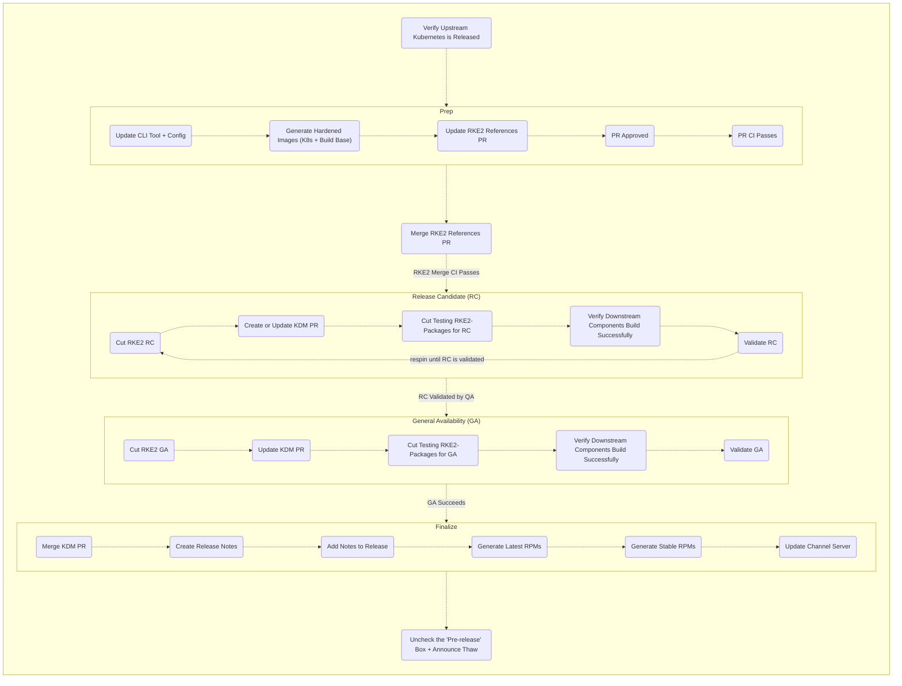

# RKE2 Release Process

This document serves as a checklist for releasing RKE2.

Consider this a checklist for RKE2 release; it is a skeleton to remind engineers who have done this before what order the steps should be taken.
There are lots of context and notes that are left out of this version, please make sure you understand how to release before using this tool.
Please see "[Releasing RKE2 Explained](./releasing_rke2_explained.md)" for more information.

[How to use the `release` CLI tool](https://github.com/rancher/ecm-distro-tools)

## Verify Upstream Kubernetes is Released

<details><summary>Details</summary>

1. Verify Release
   * Check `#discuss-k3s-rke2-channel` for scheduled upstream patch releases (enable notifications so you don't miss updates).
   * Check the Go version of each release branch (`.go-version`) and confirm `rancher/image-build-base` has published `hardened-build-base` images for those Go versions.
</details>

## Prep Release

### Update your CLI Tool and Config

<details><summary>Details</summary>

1. Check your local `release` CLI version
   ```shell
   ➜  ~ release --version
   ```
   If it's not current, download the latest release from https://github.com/rancher/ecm-distro-tools/releases. If it prints `release version development`, pull the latest tag and rebuild the binary.
1. Check your GitHub Token, in order of priority:
   1. `~/.ecm-distro-tools/config.json`,`auth.github_token` field.
   1. Environment variable `GITHUB_TOKEN`.
   1. If neither is set, set at least one.
1. Update `~/.ecm-distro-tools/config.json`, filling `rke2.versions` with an entry for each new incoming patch:
   ```json
   {
     "rke2": {
       "versions": {
         "v1.36.3": {
           "old_k8s_version": "v1.36.2",
           "new_k8s_version": "v1.36.3",
           "old_suffix": "rke2r1",
           "new_suffix": "rke2r1",
           "release_branch": "release-1.36",
           "rke2_repo_owner": "rancher",
           "rke2_repo_name": "rke2",
           "workspace": "/home/rafa/go/src/github.com/rancher",
           "dry_run": false
         }
       }
     }
   }
   ```
   Update `old_k8s_version`, `new_k8s_version`, `old_suffix`, `new_suffix`, and `release_branch` accordingly. For a new minor release (e.g. `v1.37.0`), add a new entry the same way, but set `old_k8s_version` to the previous minor's `.3` or `.4` patch, this only affects release notes generation.
</details>

### Generate Hardened Kubernetes Images

<details><summary>Details</summary>

1. Check [rancher/image-build-kubernetes](https://github.com/rancher/image-build-kubernetes) releases page for the latest release. If missing, generate it:
   * **CI Automation**: dispatch the [Sync Upstream](https://github.com/rancher/image-build-kubernetes/actions/workflows/sync-upstream.yml) workflow. Expect logs like:
     ```
     time="2026-07-24T17:31:44Z" level=info msg="Retrieving all upstream tags for 'kubernetes/kubernetes'..."
     ...
     time="2026-07-24T17:31:48Z" level=info msg="'kubernetes/kubernetes' tag 'v1.36.3' not found in 'rancher/image-build-kubernetes'."
     time="2026-07-24T17:31:49Z" level=info msg="Successfully created 'rancher/image-build-kubernetes' release 'v1.36.3-rke2r1-build20260724'"
     ```
   * **Manual Process**: create a release with tag `v<k8s_version>-rke2rN-build<YYYYMMDD>`, e.g. `v1.36.3-rke2r1-build20260724` (get the date via `TZ=utc date '+%Y%m%d'`). Release name matches the tag.
1. Check [rancher/image-build-base](https://github.com/rancher/image-build-base) releases page for the latest Go version release. If missing, generate it:
   * **CI Automation**: dispatch [Check Go versions and create releases](https://github.com/rancher/image-build-base/actions/workflows/release-go.yml). Expect logs like:
     ```
     time="2026-07-08T17:28:46Z" level=info msg="version: go1.26.5"
     time="2026-07-08T17:28:47Z" level=info msg="found alpine v3.24 for go v1.26.5"
     ...
     time="2026-07-08T17:28:47Z" level=info msg="release v1.26.5b1 doesn't exists, creating release"
     time="2026-07-08T17:28:48Z" level=info msg="created release for version: v1.26.5b1"
     ```
   * **Manual Process**: create a release with tag `v<go_version>bN`, e.g. `v1.26.5b1`. After creating it, check the [Build and Push](https://github.com/rancher/image-build-base/actions/workflows/image-push.yml) workflow and confirm it publishes `hardened-build-base` for that Go version.
</details>

### Update RKE2

<details><summary>Details</summary>

Before you start, make sure all `k3s-io/kubernetes` tags for this cycle have been pushed (see the K3s Release Process document), that's required before opening these PRs.

1. **Automated**: with your config file updated, run:
   ```shell
   release update rke2 references v1.33.13
   ```
   This opens a PR (e.g. [[release-1.35] Update to v1.35.7-rke2r1 and Go 1.25.12](https://github.com/rancher/rke2/pull/10917)) covering:
   1. `./scripts/version.sh`
      1. `KUBERNETES_VERSION` updated to the new version.
      1. `KUBERNETES_IMAGE_TAG` updated to the image from `rancher/image-build-kubernetes`.
   1. `./Dockerfile`
      1. `FROM rancher/hardened-build-base:<go_version>` updated to the new Go version.
      1. `FROM rancher/hardened-kubernetes:<kubernetes-hardened-tag> AS kubernetes` updated to the new hardened Kubernetes image.
   1. `./Dockerfile.windows` (more involved)
      1. `FROM rancher/hardened-build-base:<go_version> AS build-env` updated to the new Go version.
      1. `RUN KUBECTL_VERSION=<k8s_version> && \` updated to the new Kubernetes version.
      1. `amd64) KUBECTL_SHA256="..."` updated from `https://dl.k8s.io/release/<kubernetes_version>/bin/windows/amd64/kubectl.exe.sha256`
      1. `arm64) KUBECTL_SHA256="..."` confirm with the team whether this still mirrors the amd64 value; there is no Windows arm64 build.
      1. New version block added, with SHA256s pulled from `https://dl.k8s.io/release/<kubernetes_version>/bin/windows/amd64/{kubectl.exe,kubelet.exe,kube-proxy.exe}.sha256`:
         ```diff
             v1.36.3) \
                 KUBECTL_SHA256="" && \
                 KUBELET_SHA256="" && \
                 KUBE_PROXY_SHA256=""; \
         ```
   1. `./go.mod`
      1. `go <go_version>` updated to the upstream Go version.
      1. All `k8s.io/* => github.com/k3s-io/kubernetes/* v<kubernetes_version>-k3sN` entries updated.
1. **Manual**: open the PR(s) yourself, following the same checklist above, targeting `release-<k8s_minor_version>` (e.g. `release-1.36`).
1. Create a pull request
   * set reviewers to the "k3s" group
   * assign to yourself
   * make sure the target branch is correct for the PR
1. Once your PR gets 2 approvals and CI completes successfully, merge it
</details>

## Create RKE2 Release Candidate (RC)

### Cut RKE2 Release

<details><summary>Details</summary>

Before tagging, double-check that:
* The new hardened Kubernetes image is built and published.
* The new hardened build-base image is built and published.
* The release branches are updated with the new Kubernetes version, `k3s-io/kubernetes` libraries, and Go version.
* You've pinged `@k3s-rke2-team` about anything pending, and checked [open PRs](https://github.com/rancher/rke2/pulls).

1. **Automated**: for each new patch release:
   ```shell
   release tag rke2 rc v1.33.13
   ```
   Check the [Release Workflow](https://github.com/rancher/rke2/actions/workflows/release.yml).

   Known errors:
   * `Create draft release '...'` job hangs (normally 5–10 min, a GitHub API issue unrelated to the release itself). Either wait it out (1–2 hours) or cancel the job, delete the draft release, and re-run the failed jobs.
   * `Sync Prime Ribs (..., ...)` job fails with `MANIFEST_UNKNOWN` for a hardened image (e.g. `rancher/hardened-livenessprobe:v2.19.0-build20260722`). The image isn't yet covered by the Staging Registry publish step. Copy the missing image reference into the [Sync Images to Staging Workflow](https://github.com/rancher/rancher-prime/actions/workflows/sync-to-stg.yml) and re-run.
1. **Manual**: tag following `v<k8s_version>-rcN+rke2r1`, e.g. `v1.36.3-rc1+rke2r1`. `N` starts at `1`.
</details>

### Create or Update KDM PR

<details><summary>Details</summary>

1. Fork `rancher/kontainer-driver-metadata`, branch off each active dev branch. As of this writing:
   * `dev-v2.15`
   * `dev-v2.14`
   * `dev-v2.13`
   * `dev-v2.12`
1. For each branch, add the new RKE2 entries:
   ```shell
   release generate kdm rke2 --releases "<comma-separated-list-of-releases>"
   ```
   Check `channels-rke2.yaml` for which RKE2 minors that branch supports (`maxChannelServerVersion`). For example, for `dev-v2.15`:
   ```shell
   release generate kdm rke2 --releases "v1.34.10-rc3+rke2r1,v1.35.7-rc3+rke2r1,v1.36.3-rc3+rke2r1"
   ```
1. Commit the `channels-rke2.yaml` change
1. Regenerate derived assets
   ```shell
   go generate
   ```
1. Commit the generated assets separately
1. Create a pull request for each branch
   * PR title format: `[<dev-branch>] RKE2 <Month> patch`
</details>

### Cut RKE2-Packaging Release

<details><summary>Details</summary>

1. Publish testing RPMs for each new RC, following `v<k8s_version>-rcN+rke2r1.testing.0`, e.g. `v1.36.3-rc1+rke2r1.testing.0`.
1. Go to [rancher/rke2-packaging](https://github.com/rancher/rke2-packaging), open the releases page, and cut a new release per patch.
</details>

### Verify Downstream Components Build Successfully

<details><summary>Details</summary>

1. Validate that CIs pass for:
   * system-agent-installer-rke2
     * [Repository](https://github.com/rancher/system-agent-installer-rke2)
   * rke2-upgrade
     * [Repository](https://github.com/rancher/rke2-upgrade)

   Known errors:
   * `Publish Image` step 404s on the release asset (e.g. `curl: (22) The requested URL returned error: 404`), the downstream build triggered before assets finished publishing; re-run the workflow.
   * `Publish Image` step fails installing `slsactl` (`invalid version: unknown revision null`), flaky; re-run the workflow.
</details>

### Validate RC

<details><summary>Details</summary>

1. Share the RCs with QA, start a thread in `#discuss-k3s-rke2-channel`:
   ```
   RCs cut:

   - v1.33.13-rc5+rke2r2
   - v1.34.10-rc4+rke2r1
   - v1.35.7-rc4+rke2r1
   - v1.36.3-rc4+rke2r1


   KDM PRs updated:

   - [dev-v2.15] RKE2 July patch
   - [dev-v2.14] RKE2 July patch
   - [dev-v2.13] RKE2 July patch
   - [dev-v2.12] RKE2 July patch

   Testing RPMs published.

   cc: @k3s-rke2-qa @Caroline O'Hara @Chris Wayne
   ```
1. Look for the QA validation report
</details>

## Prep R2

<details><summary>Details</summary>

1. Follow [the release candidate steps](#create-rke2-release-candidate-rc) again, the `release tag rke2 rc` command automatically increments the RC number, and the process is otherwise identical.
1. The only step that differs across RC rounds is KDM, the `release` CLI doesn't support updating existing KDM entries for a new RC round, so it's manual. Either:
   * manually update each entry and commit (remember `go generate`), or
   * discard the previous commits and re-run `release generate kdm rke2` with the new RC list, then commit (remember `go generate`).
1. **Note:** an `rke2r2` (as opposed to a same-round `rke2r1` respin) should be treated as the exception, not the default, it means a real bug made it past RC into GA. Confirm with `@k3s-rke2-team` before committing to it, since it fans back out into every downstream step a second time.
</details>

## Cut GA RKE2 Release

<details><summary>Details</summary>

Before cutting GAs, make sure all KDM PRs are passing CI, a KDM PR failure has previously slipped through with GAs already cut, shipping a bug that required an `rke2r2` release to fix.

1. **Automated**:
   ```shell
   release tag rke2 ga v1.33.13
   ```
   Run once per patch. The same CI and downstream-component verification from the RC process applies.
1. **Manual**: tag as with an RC, but omit the `-rcN` part, e.g. `v1.36.3+rke2r1`.
</details>

**NOTE** Once the GA tags are created, the KDM PR, Release Notes, and GA RPM steps can all be done/should be done in tandem with one another.

## Finalize Release

### Merge KDM PR

<details><summary>Details</summary>

1. Update the KDM PRs with the new GAs, a simple find/replace removing `-rcN` from `channels-rke2.yaml` works. Remember `go generate`.
1. Get the proper approvals
1. Make sure CI passes
1. Make sure the team is ready
1. Merge KDM PR
</details>

### Create Release Notes

<details><summary>Details</summary>

1. Run the update command, once per branch:
   ```shell
   release generate rke2 release-notes --milestone v1.36.2+rke2r1 --prev-milestone v1.36.1+rke2r2 > rke2/v1.36.md
   release generate rke2 release-notes --milestone v1.35.6+rke2r1 --prev-milestone v1.35.5+rke2r2 > rke2/v1.35.md
   release generate rke2 release-notes --milestone v1.34.9+rke2r1 --prev-milestone v1.34.8+rke2r2 > rke2/v1.34.md
   release generate rke2 release-notes --milestone v1.33.13+rke2r1 --prev-milestone v1.33.12+rke2r2 > rke2/v1.33.md
   ```
   (Clone `rancherlabs/release-notes` and branch for this release cycle first.)
1. Copy the generated release notes
1. Validate and update the release notes as necessary
   1. Validate and update the "Changes since" section
   1. Validate and update the "Packaged Components" section
      * It can be confusing to track where each component's version is pulled from, see the [packaged components subsection](#packaged-components)
   1. Validate and update the "Available CNIs" section in `scripts/build-images`
1. Get PR approval, this PR should only merge after the GA `stable` RPMs are validated
1. Merge PR
1. Copy notes into the GitHub Release page, **keep the release in pre-release**; unchecking `Pre-release` is the last step of the whole process

#### Packaged Components

| Component       | File                   | String                                       | Example                                                                  |
| --------------- | ---------------------- | --------------------------------------------- | ------------------------------------------------------------------------ |
| Kubernetes      | `Dockerfile`           | `FROM rancher/hardened-kubernetes`           | `rancher/hardened-kubernetes:v1.36.3-rke2r1-build20260724`               |
| Go              | `Dockerfile` / `Dockerfile.windows` | `FROM rancher/hardened-build-base`  | `rancher/hardened-build-base:v1.26.5b1`                                  |
| Etcd            | `scripts/version.sh`   | `ETCD_VERSION`                               | `ETCD_VERSION=${ETCD_VERSION:-v3.5.4-k3s1}`                              |
| Containerd      | `Dockerfile`           | `FROM rancher/hardened-containerd`           | `rancher/hardened-containerd:v1.6.6-k3s1-build20260606`                  |
| Runc            | `Dockerfile`           | `FROM rancher/hardened-runc`                 | `rancher/hardened-runc:v1.1.2-build20260606`                             |
| Metrics-Server  | `scripts/build-images` | `rancher/hardened-k8s-metrics-server`        | `${REGISTRY}/rancher/hardened-k8s-metrics-server:v0.5.0-build20260119`   |
| CoreDNS         | `scripts/build-images` | `rancher/hardened-coredns`                   | `${REGISTRY}/rancher/hardened-coredns:v1.9.3-build20260613`              |
| Ingress-Nginx   | `Dockerfile`           | `CHART_FILE=/charts/rke2-ingress-nginx.yaml` | `RUN CHART_VERSION="4.1.003" CHART_FILE=/charts/rke2-ingress-nginx.yaml` |
| Helm-controller | `go.mod`               | `helm-controller`                            | `github.com/k3s-io/helm-controller v0.12.3`                              |

> Rows below Kubernetes/Go are carried over from the previous version of this guide and haven't been independently re-verified against a current `release-1.36` branch, worth a quick sanity check the first time you use this table.

</details>

### Cut RKE2-Packaging Latest RPMs

<details><summary>Details</summary>

1. Cut a release using [the same steps as testing RPMs](#cut-rke2-packaging-release), but only after QA validates the testing RPMs, using tag format `v<k8s_version>+rke2r1.latest.0`, e.g. `v1.36.3+rke2r1.latest.0`.
</details>

### Cut RKE2-Packaging Stable RPMs

<details><summary>Details</summary>

1. Cut a release using [the same steps as testing RPMs](#cut-rke2-packaging-release), but only after QA validates the latest RPMs, using tag format `v<k8s_version>+rke2r1.stable.0`, e.g. `v1.36.3+rke2r1.stable.0`.
1. If QA hits caching errors pulling the RPMs (`Bad GPG signature`, `No matching Packages to list`), have them clear their cache and retry, or wait a couple of hours, this usually resolves on its own. If not, ping `@Vitor Savian` (an `rke2-packaging` maintainer).
</details>

### Update Channel Server

<details><summary>Details</summary>

1. Edit the `channels.yaml` file in the [RKE2 repo](https://github.com/rancher/rke2/blob/master/channels.yaml), **only on `master`**:
   ```yaml
   channels:
   - name: stable
     latest: v1.35.6+rke2r1 # THIS LINE
   ```
   - If a new minor version is released, you will also need to add a new entry for it, e.g.:
   ```yaml
   - name: v1.36
     latestRegexp: v1\.36\..*
     excludeRegexp: ^[^+]+-
   ```
1. Only bump the minor version if the new patch number is higher than `3`, e.g. `v1.36.3+rke2r1` does **not** trigger a minor bump, but `v1.36.4+rke2r1` does.
1. Get PR approval, this PR should only merge after the GA `stable` RPMs are validated
1. Validate CI passes
1. Verify JSON output from a call [here](https://update.rke2.io/v1-release/channels)
</details>

## Uncheck the Pre-release Checkbox

<details><summary>Details</summary>

1. After the GA `stable` RPMs are validated, go to the GA releases, edit them, and uncheck the "Pre-release" checkbox. The highest minor version becomes "latest."
1. Announce the thaw in `#discuss-k3s-rke2-channel`:
   ```
   Release notes pasted in, KDM PRs and Channel Server PR merged and pre-release unchecked.

   RKE2 release is finished, and the branches 1.33~1.36 are now unfrozen.

   cc: @Caroline O'Hara @Chris Wayne
   ```
</details>

## Flowchart


```mermaid
flowchart LR

subgraph Overview [" "]
  direction TB
  Start("Verify Upstream Kubernetes is Released") -..-> Prep -..->
  PR("Merge RKE2 References PR") -."RKE2 Merge CI Passes".-> RC
  RC -."RC Validated by QA".-> GA -."GA Succeeds".-> Finalize -..->
  End("Uncheck the 'Pre-release' Box + Announce Thaw")
end

CliCfg("Update CLI Tool + Config")
GenImage("Generate Hardened Images (K8s + Build Base)")
PrCreate("Update RKE2 References PR")
PrApprove("PR Approved")
PrPass("PR CI Passes")
subgraph Prep
  direction LR
  CliCfg -..-> GenImage -..-> PrCreate -..-> PrApprove -..-> PrPass
end

RcCut("Cut RKE2 RC")
RcKdm("Create or Update KDM PR")
RcRpm("Cut Testing RKE2-Packages for RC")
RcDown("Verify Downstream Components Build Successfully")
RcQa("Validate RC")
subgraph RC ["Release Candidate (RC)"]
  direction LR
  RcCut -..-> RcKdm -..-> RcRpm -..-> RcDown -..-> RcQa
  RcQa -."respin until RC is validated".-> RcCut
end

GaCut("Cut RKE2 GA")
GaKdm("Update KDM PR")
GaRpm("Cut Testing RKE2-Packages for GA")
GaDown("Verify Downstream Components Build Successfully")
GaQa("Validate GA")
subgraph GA ["General Availability (GA)"]
  direction LR
  GaCut -..-> GaKdm -..-> GaRpm -..-> GaDown -..-> GaQa
end

KdmMerge("Merge KDM PR")
RnCreate("Create Release Notes")
RnAdd("Add Notes to Release")
RpmLatest("Generate Latest RPMs")
RpmStable("Generate Stable RPMs")
CsUp("Update Channel Server")
subgraph Finalize
  direction LR
  KdmMerge -..-> RnCreate -..-> RnAdd -..->
  RpmLatest -..-> RpmStable -..-> CsUp
end
```
