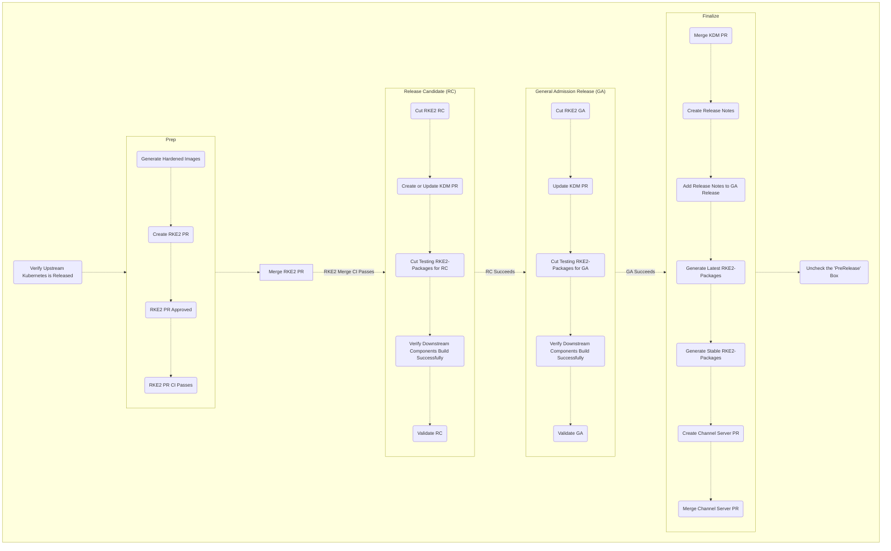

# RKE2 Release Process

This document serves as a "how to" for releasing RKE2.  
This means that "why to" is specifically left out.
There is a new document for _why_ we follow this procedure and how change propagates throughout the system.
Consider this a script for RKE2 release; it is a skeleton to remind engineers who have done this before what order the steps should be taken.
There are lots of context and notes that are left out of this version, please make sure you understand how to release before using this tool.
Please see "[Releasing RKE2 Explained](./releasing_rke2_explained.md)" for more information.

This process is used any time we release a new version of RKE2.


Before making any pull requests, please make sure you understand the 
[common open source forking workflow](https://github.com/firstcontributions/first-contributions)
and [Developer Certificate of Origin](https://www.secondstate.io/articles/dco/).
We use this workflow and signed commits for all contributions.  

[How to use tools](./releasing_rke2_explained.md#tools)

## Verify Upstream Kubernetes is Released

<details><summary>Details</summary>

```shell
export GHT="<your github token>"
export K8S_RELEASES='v1.21.14 v1.22.11 v1.23.8 v1.24.2'
alias edt='docker run --rm -it --env GITHUB_TOKEN=$GHT rancher/ecm-distro-tools'
edt check_for_k8s_release -r "$K8S_RELEASES"
```
One liner to poll every 5min:
```shell
while true; do date; edt check_for_k8s_release -r "$K8S_RELEASES"; sleep 300; done
```
</details>

## Prep Release

### Generate Hardened Images

<details><summary>Details</summary>

```shell
export GHT='<your github token>'
export K8S_RELEASES='v1.21.14 v1.22.11 v1.23.8 v1.24.2'
export RKE2_RELEASES='v1.21.14+rke2r1 v1.22.11+rke2r1 v1.23.8+rke2r1 v1.24.2+rke2r1'
export IMAGE_BUILD_RKE2_RELEASES='v1.21.14-rke2r1 v1.22.11-rke2r1 v1.23.8-rke2r1 v1.24.2-rke2r1'
alias edt='docker run --rm -it --env GITHUB_TOKEN=$GHT rancher/ecm-distro-tools'
edt tag_image_build_k8s_release -r "$IMAGE_BUILD_RKE2_RELEASES"
```
</details>

### Update RKE2

<details><summary>Details</summary>

Before this PR is merged the [hardened images must be published](https://hub.docker.com/r/rancher/hardened-kubernetes).

1. Setup origin branch
1. Update the following files
  1. `./Dockerfile`
      1. `FROM rancher/hardened-kubernetes:v1.23.5-rke2r1-build20220217 AS kubernetes`
      1. `RUN CHART_VERSION="v1.21.10-build2021041301" CHART_FILE=/charts/rke2-kube-proxy.yaml`
  1. `./scripts/version.sh`
      1. `KUBERNETES_VERSION=${KUBERNETES_VERSION:-v1.23.5}`
  1. `./go.mod`
  1. `./go.sum`
1. Add, commit, and push to origin
1. Create a pull request
   * set reviewers to "k3s" group
   * assign to yourself
   * make sure upstream branch is appropriate for PR (eg. `release-1.23` for `june-release-1.23-r1`)
1. PR triggers [Drone-pr CI](https://drone-pr.rancher.io/rancher/rke2)
1. Once your PR gets 2 approvals, and the CI completes successfully, you may merge it
1. Merge triggers [Drone-publish CI](https://drone-publish.rancher.io/rancher/rke2)
</details>

## Create Release Candidate (RC)

### Cut RKE2 Release

<details><summary>Details</summary>

```shell
export GHT='<your github token>'
export K8S_RELEASES='v1.21.14 v1.22.11 v1.23.8 v1.24.2'
export RKE2_RELEASES='v1.21.14-rc1+rke2r1 v1.22.11-rc1+rke2r1 v1.23.8-rc1+rke2r1 v1.24.2-rc1+rke2r1'
export IMAGE_BUILD_RKE2_RELEASES='v1.21.14-rke2r1 v1.22.11-rke2r1 v1.23.8-rke2r1 v1.24.2-rke2r1'
export MASTER_RELEASE_VERSION='v1.24' # the version represented in the master branch
alias edt='docker run --rm -it --env GITHUB_TOKEN=$GHT rancher/ecm-distro-tools'
edt tag_rke2_release -m $MASTER_RELEASE_VERSION "$RKE2_RELEASES"
```
</details>

### Create or Update KDM PR

<details><summary>Details</summary>

1. Update `./channels-rke2.yaml`
   1. Setup your local branch
   1. Copy the previous version and paste it after itself
   1. Update the version number to the one you want to add
   1. Update the anchors to the new version number
   1. Update the aliases to the previous node
   1. Compare the versions
   1. Overwrite any changes to chart versions from the previous tag
   1. Overwrite any Agent CLI arg changes
   1. Overwrite any Server CLI arg changes
   1. Set the default version
1. Commit change
1. Generate json file
1. Commit change with "go generate" message
   * make sure that your commit message is exactly "go generate"
1. Create pull request
   * prepend `[WIP]:` to the title of the PR to make sure it is interpreted properly

</details>

### Cut RKE2-Packaging Release

<details><summary>Details</summary>

```shell
export GHT='<your github token>'
export K8S_RELEASES='v1.21.14 v1.22.11 v1.23.8 v1.24.2'
export RKE2_RELEASES='v1.21.14-rc1+rke2r1 v1.22.11-rc1+rke2r1 v1.23.8-rc1+rke2r1 v1.24.2-rc1+rke2r1'
export IMAGE_BUILD_RKE2_RELEASES='v1.21.14-rke2r1 v1.22.11-rke2r1 v1.23.8-rke2r1 v1.24.2-rke2r1'
export MASTER_RELEASE_VERSION='v1.24' # the version represented in the master branch
export RPM_RELEASE_ITERATION=0 # usually 0, but may increment if RPMs need to be re-released
alias edt='docker run --rm -it --env GITHUB_TOKEN=$GHT rancher/ecm-distro-tools'
# '-t' is for testing channel, this will change to '-s' for stable, and '-l' for latest
edt tag_rke2_packaging_release -t -i $RPM_RELEASE_ITERATION -r "$RKE2_RELEASES"
```
This operation triggers [Drone-publish](https://drone-publish.rancher.io/rancher/rke2-packaging/) automation.  
</details>

### Verify Downstream Components Build Successfully

<details><summary>Details</summary>

* system-agent-installer-rke2
  * [Repository](https://github.com/rancher/system-agent-installer-rke2)
  * [Drone publish job](https://drone-publish.rancher.io/rancher/system-agent-installer-rke2)
* rke2-upgrade
  * [Repository](https://github.com/rancher/rke2-upgrade)
  * [Drone publish job](https://drone-publish.rancher.io/rancher/rke2-upgrade)
</details>

### Validate RC

Look for the QA validation report for more information.

## Prep R2

<details><summary>Details</summary>
While waiting on validation for RC, prep a new release, following [the release prep steps](#prep-release), use `r2` instead of `r1`.
eg. `v1.24.2+rke2r2` instead of `v1.24.2+rke2r1`
**Note:** Do not merge the R2 prep PR, it hopefully will not be necessary.
</details>

## Cut GA RKE2 Release

<details><summary>Details</summary>

Once the RC is approved for release, it's time to cut the general admission (GA) release.  
Create a new release just like [the RC release](#create-release-candidate-rc), omit the `-rc` part of the tags.
</details>

## Finalize Release

### Merge KDM PR

Once you have the proper approvals and the team is ready, merge the KDM PR.

### Create Release Notes

<details><summary>Details</summary>

1. Setup your local branch
1. Run the update script
   ```shell
   export GHT='<your github token>'
   alias edt='docker run --rm -it --env GITHUB_TOKEN=$GHT rancher/ecm-distro-tools'
   edt gen_release_notes -r rke2 -m v1.24.2-rc1+rke2r1 -p v1.24.1+rke2r2
   ```
1. Copy the generated release notes
1. Validate and update the release notes as necessary
   1. Validate and update "Changes since" section
   1. Validate and update "Packaged Components" section
      * It can be confusing to track where each number for a component is getting pulled from, see [packaged components subsection](#packaged-components)
   1. Validate and update "Available CNIs" section
      * All CNIs are validated in the same file `scripts/build-images`
1. Once the release notes PR is approved and merged through the normal review and approval process,
   copy the contents of the files and paste them into the release itself, by editing the relevant release
   * Before adding the release notes to a release, make sure to review all steps again, in case some versions or charts update

#### Packaged Components

| Component | File | String | Example |
| --- | --- | --- | --- |
| Kubernetes      | `Dockerfile`           | `FROM rancher/hardened-kubernetes`           | `rancher/hardened-kubernetes:v1.24.2-rke2r1-build20220617` |
| Etcd            | `scripts/version.sh`   | `ETCD_VERSION`                               | `ETCD_VERSION=${ETCD_VERSION:-v3.5.4-k3s1}` |
| Containerd      | `Dockerfile`           | `FROM rancher/hardened-containerd`           | `rancher/hardened-containerd:v1.6.6-k3s1-build20220606` |
| Runc            | `Dockerfile`           | `FROM rancher/hardened-runc`                 | `rancher/hardened-runc:v1.1.2-build20220606` |
| Metrics-Server  | `scripts/build-images` | `rancher/hardened-k8s-metrics-server`        | `${REGISTRY}/rancher/hardened-k8s-metrics-server:v0.5.0-build20211119` |
| CoreDNS         | `scripts/build-images` | `rancher/hardened-coredns`                   | `${REGISTRY}/rancher/hardened-coredns:v1.9.3-build20220613` |
| Ingress-Nginx   | `Dockerfile`           | `CHART_FILE=/charts/rke2-ingress-nginx.yaml` | `RUN CHART_VERSION="4.1.003" CHART_FILE=/charts/rke2-ingress-nginx.yaml` |
| Helm-controller | `go.mod`               | `helm-controller`                            | `github.com/k3s-io/helm-controller v0.12.3` |

</details>

### Cut RKE2-Packaging Latest RPMs

<details><summary>Details</summary>

After 24 hours, we'll cut "Latest" RPMs.
This involves [the same steps for RPM releases](#create-rke2-packaging-release) but changing "testing" to "latest" in the release name.  
E.g. `v1.24.2+rke2r1.latest.0`.
</details>

### Cut RKE2-Packaging Stable RPMs

<details><summary>Details</summary>

After 24 hours, we'll cut "Stable" RPMs.
This involves [the same steps for RPM releases](#create-rke2-packaging-release) but changing "latest" to "stable" in the release name.  
E.g. `v1.21.5+rke2r1.stable.0`.
</details>

### Update Channel Server

<details><summary>Details</summary>
After releasing stable RPMs, we need to update the channel server.
This is done by editing the `channels.yaml` file in the [RKE2 repo](https://github.com/rancher/rke2/blob/master/channels.yaml).

* Update the line: `latest: <release>` to be the latest version of the arbitrarily decided version (ask in the release channel)
* PR must pass CI and get 2 approvals before merge
* Validate publish CI passes before moving to next step
* Verify updated in the JSON output from a call [here](https://update.rke2.io/v1-release/channels).
</details>

## Uncheck the Pre-release Checkbox

Go to the GA releases, edit them, and uncheck the "prerelease" checkbox.

## Flowchart

