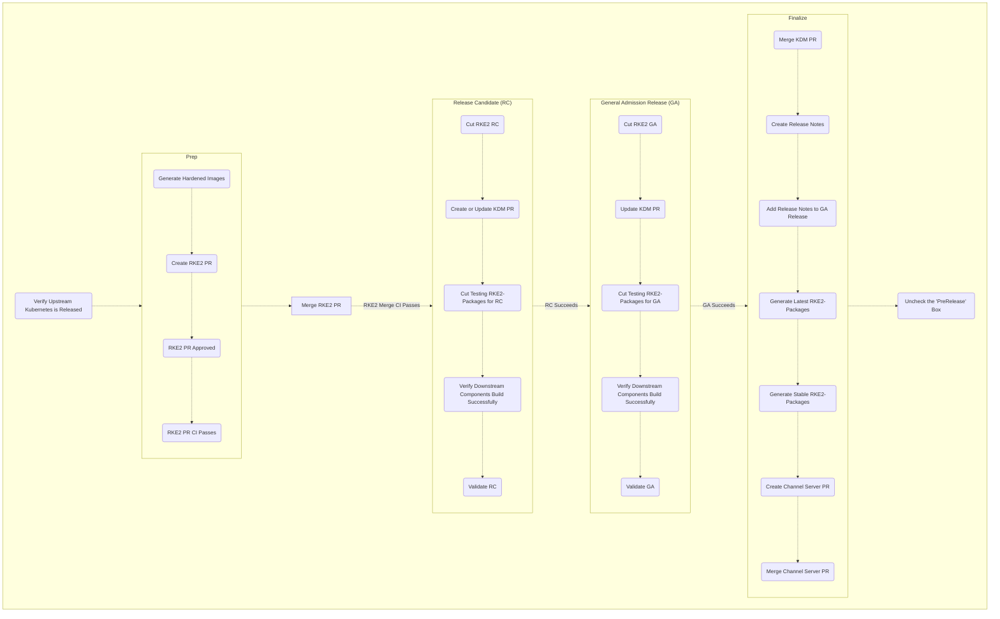

# RKE2 Release Process

This document serves as an in-depth walkthrough for releasing RKE2.  

This process is used any time we release a new version of RKE2.
In many cases this is to incorporate a new patch from upstream Kubernetes.
We like to synchronize changes to RKE2 with Kubernetes patches, which happen on a regular basis.
This means that any changes to RKE2 are held onto until the upstream Kubernetes patch version comes out.
We implement a code freeze just before the Kubernetes release to facilitate a stable test version.
Much of the context for this document assumes that we are in a code freeze and that we are upgrading Kubernetes,
 closely following a release from the [Kubernetes](https://github.com/kubernetes/kubernetes) repo.

**Note:**
[GitHub Automatically Generates a Table of Contents for Markdown](https://github.blog/changelog/2021-04-13-table-of-contents-support-in-markdown-files/)  
**Note:**
[How to use tools](#tools)

## Setup Communication Channels

It is good to prep a release by creating the communication channels necessary to keep everyone on the same page.
We generally communicate with three tools: Slack, Confluence, and GitHub.

### Slack

We generate a Slack thread in the #discuss-rancher-k3s-rke2-release channel, and pin it to the channel.
The title is usually something like "RKE2 Release :thread:" where the ':thread:' will be replaced by an emoji.
[Example](https://suse.slack.com/archives/C02DNASKFQB/p1657646877944789)

### Confluence

We post information (links and such) to a confluence doc, so that everyone is able to quickly find information regarding the release.
This also serves as a place where we can review and audit release information.
There is no official place to put these reports, so it is fine to place them in your personal space in Confluence, please make sure they are viewable by the team.
The title is generally "RKE2 <month> Release", [example](https://confluence.suse.com/display/~mtrachier/RKE2+July+Release).
Copy the previous month, update the title, remove all the links, then post the link to the doc in the release thread, and you are ready to go.

### GitHub

In general we (the release captains) communicate about git operations in GitHub; code reviews, pull requests, and issues/tasks.
These are all public communication sources, so please be aware of the larger audience.
There should be GH milestones generated for each release version, make sure to add them to the Confluence page.
If they do not exist, please ask about them in the #discuss-rancher-k3s-rke2-release channel.

## Verify Upstream Kubernetes is Released

Before we start a release we need to make sure that upstream Kubernetes is published.

<details><summary>Tool</summary>

Before using tools, please see the [Tools section](#tools)  
[ECM Check for K8s Release](https://github.com/rancher/ecm-distro-tools/blob/master/bin/check_for_k8s_release)  

```shell
export GHT="<your github token>"
export K8S_RELEASES='v1.21.14 v1.22.11 v1.23.8 v1.24.2'
alias edt='docker run --rm -it --env GITHUB_TOKEN=$GHT rancher/ecm-distro-tools'
edt check_for_k8s_release -r "$K8S_RELEASES"
```
One liner to poll every 5min:
```shell
while true; do date; edt check_for_k8s_release -r "$K8S_RELEASES"; sleep 300; done
```
</details>

<details><summary>Manual</summary>

1. go to [kubernetes repo releases](https://github.com/kubernetes/kubernetes/releases)
1. search for the specific version title that you would like to check,
for instance: ["Kubernetes v1.24.1"](https://github.com/kubernetes/kubernetes/releases?q=%22Kubernetes+v1.24.1%22)
</details>

## Prep Release
### Generate Hardened Kubernetes Images

We compile Kubernetes and a selection of container images to have a higher level of security.
The Kubernetes images are published to [Dockerhub](https://hub.docker.com/r/rancher/hardened-kubernetes).
As individual third party images are published
 we [publish secure versions of their software as well](https://hub.docker.com/search?q=rancher%2Fhardened).
The first stage to releasing RKE2 is generating a release for the hardened images and making sure they publish properly.
The median build time for the [CI](https://drone-publish.rancher.io/rancher/image-build-kubernetes) is about 14 min,
but it has taken up to an hour historically.
After the automation completes you will see new images in the [Dockerhub repo](https://hub.docker.com/r/rancher/hardened-kubernetes).

<details><summary>Tool</summary>

Before using tools, please see the [Tools section](#tools)  
[ECM Tag Image Build K8S](https://github.com/rancher/ecm-distro-tools/blob/master/bin/tag_image_build_k8s_release)
```shell
export GHT='<your github token>'
export K8S_RELEASES='v1.21.14 v1.22.11 v1.23.8 v1.24.2'
export RKE2_RELEASES='v1.21.14+rke2r1 v1.22.11+rke2r1 v1.23.8+rke2r1 v1.24.2+rke2r1'
export IMAGE_BUILD_RKE2_RELEASES='v1.21.14-rke2r1 v1.22.11-rke2r1 v1.23.8-rke2r1 v1.24.2-rke2r1'
alias edt='docker run --rm -it --env GITHUB_TOKEN=$GHT rancher/ecm-distro-tools'
edt tag_image_build_k8s_release -r "$IMAGE_BUILD_RKE2_RELEASES"
```
</details>

<details><summary>Manual</summary>

1. go to [image-build-kubernetes repo](https://github.com/rancher/image-build-kubernetes)
1. go to [releases](https://github.com/rancher/image-build-kubernetes/releases)
1. click "draft a new release" button to get to [the new release page](https://github.com/rancher/image-build-kubernetes/releases/new)
1. validate the date in UTC `TZ=utc date '+%Y%m%d'`, 
   remember that UTC may be significantly different than your time zone and the day of the month may be different
1. set the title to the RKE2 release version (replace plus with dash), appending "-build" then the date in "YYYYMMDD" format UTC
   1. as an example for rke2 release version 'v1.12.14+rke2r1' the title would be 'v1.12.14-rke2r1-build20220616'
   1. do not include any 'rc', 'beta', or any other qualifiers
   1. as an example for an rke2 rc release you _wouldn't_ use  `v1.12.14-rc1-rke2r1-build...`
1. make sure the target branch is 'master'
1. no release details or release notes
</details>

### Update RKE2

We must update RKE2 to point to the new hardened images, this is a manual process.
Before this PR is merged the [hardened images must be published](https://hub.docker.com/r/rancher/hardened-kubernetes).

Before making any pull requests, please make sure you understand:
- [Common open source forking workflow](https://github.com/firstcontributions/first-contributions)
- [Developer Certificate of Origin](https://www.secondstate.io/articles/dco/)
- [Our open source forking workflow](#our-forking-workflow)

<details><summary>Manual</summary>

1. Setup your local branch
   * it is easier to tell your fork from the upstream if you name your branch something unique and meaningful
     I have found this to be a good template: `june-release-v1.23-r1`
   * the `master` branch always relates to the latest k8s version, currently 1.24
   * the upstream branch will be `master` for the latest k8s version, currently 1.24
   * your fork will have a different branch name than where you want the PR to go,
     this gives an clear reference to prevent accidentally merging the wrong branches together
   * I have found that it helps to specify the rke2 release version in the branch, `-r1`, `-r2`, etc.,
     please see the [RKE2 versioning section](#rke2-versioning) for more information.
1. Update the following files
   1. `./Dockerfile`
      1. `FROM rancher/hardened-kubernetes:v1.23.5-rke2r1-build20220217 AS kubernetes`
         * this is [the hardened image](https://hub.docker.com/r/rancher/hardened-kubernetes)
           that we generated in the previous step, make sure it matches
      1. `RUN CHART_VERSION="v1.21.10-build2021041301" CHART_FILE=/charts/rke2-kube-proxy.yaml`
         * v1.21 only since it is the last version to use kube-proxy
         * these specifically reference our hardened build image for
           [kube-proxy](https://hub.docker.com/r/rancher/hardened-kube-proxy/tags), make sure it matches
   1. `./scripts/version.sh`
      1. `KUBERNETES_VERSION=${KUBERNETES_VERSION:-v1.23.5}`
      * this references the upstream kubernetes version,
        [make sure it matches the tag](https://github.com/kubernetes/kubernetes/tags)
   1. `./go.mod`
      * this file can only be updated _after_ k3s releases
      * ignore this file if your change is being made before k3s has released
   1. `./go.sum`
      * use the `go mod tidy` go tool to update this file after updating go.mod
      * this file can only be updated _after_ k3s releases
      * ignore this file if your change is being made before k3s has released
   * We ignore any qualifiers, don't use 'rc', 'beta', or anything other than the intended release name.
     * Example: for `v1.23.9+rke2r1`
     * GOOD: `v1.23.9+rke2r2` if releasing an `r2`
     * BAD: `v1.23.9-rc1+rke2r1` for an `rc1`
1. add, commit, and push
   * example commit message: `update k8s to v1.23.9`
1. Create a pull request
   * set reviewers to `k3s` group
   * assign to yourself
   * example: https://github.com/rancher/rke2/pull/2994
1. PR triggers [Drone-pr CI](https://drone-pr.rancher.io/rancher/rke2)
   * example pr ci: https://drone-pr.rancher.io/rancher/rke2/3456
1. Once your PR gets 2 approvals, and the CI completes successfully, you may merge it
1. Merge triggers [Drone-publish CI](https://drone-publish.rancher.io/rancher/rke2)
   * example publish ci: https://drone-publish.rancher.io/rancher/rke2/1847
</details>

## Create RKE2 Release Candidate (RC)
### Cut RKE2 Release

After updating RKE2, we generate a release candidate for internal testing.
A release candidate is a release with the "-rc" in [the prerelease section of the version number](https://semver.org/#spec-item-9).
Please see [RKE2 versioning section](#rke2-versioning).

<details><summary>Tool</summary>

Before using tools, please see the [Tools section](#tools)  
[ECM Tag RKE2 Release](https://github.com/rancher/ecm-distro-tools/blob/master/bin/tag_rke2_release)
```shell
export GHT='<your github token>'
export K8S_RELEASES='v1.21.14 v1.22.11 v1.23.8 v1.24.2'
export RKE2_RELEASES='v1.21.14-rc1+rke2r1 v1.22.11-rc1+rke2r1 v1.23.8-rc1+rke2r1 v1.24.2-rc1+rke2r1'
export IMAGE_BUILD_RKE2_RELEASES='v1.21.14-rke2r1 v1.22.11-rke2r1 v1.23.8-rke2r1 v1.24.2-rke2r1'
export MASTER_RELEASE_VERSION='v1.24' # the version represented in the master branch
alias edt='docker run --rm -it --env GITHUB_TOKEN=$GHT rancher/ecm-distro-tools'
edt tag_rke2_release -m $MASTER_RELEASE_VERSION "$RKE2_RELEASES"
```
</details>

<details><summary>Manual</summary>

1. go to [rke2 repo](https://github.com/rancher/rke2)
1. click ["Releases"](https://github.com/rancher/rke2/releases)
1. click ["Draft new release"](https://github.com/rancher/rke2/releases/new)
1. select the target branch
   * example release branch: `release-1.23`
   * be aware of the version which the `master` branch represents
   * one of the releases will target the `master` branch
   * please see [rke2 versioning](#rke2-versioning)
1. enter the desired version into the "Tag version" box
   * example tag: `v1.23.5-rc1+rke2r1`
1. ensure "prerelease" checkbox is selected
1. click the "create release" button to submit the form
</details>

This operation triggers [Drone-publish](https://drone-publish.rancher.io/rancher/rke2/) automation.  
The publish automation also dispatches the CI in [Rancher RKE2-Upgrade repo](https://github.com/rancher/rke2-upgrade) 
to release [RKE2-Upgrade Images](https://hub.docker.com/r/rancher/rke2-upgrade/tags)  

<details><summary>Examples</summary>

[Example RC Release](https://github.com/rancher/rke2/releases/tag/v1.21.13-rc1%2Brke2r1)  
[Example CI](https://drone-publish.rancher.io/rancher/rke2/1844)  
[Example Dispatch](https://drone-publish.rancher.io/rancher/rke2/1844/2/2)  
[Example Upgrade Image CI](https://drone-publish.rancher.io/rancher/rke2-upgrade/352/1/3)  
[Example Upgrade Image Container](https://hub.docker.com/layers/rke2-upgrade/rancher/rke2-upgrade/v1.21.13-rke2r2/images/sha256-d912f762a032edd20525920a1cc8e5614ae969f76a815a46e7364b45bfc7c61b?context=explore)  
</details>

### Create or Update KDM PR

[Kontainer Driver Metadata](https://github.com/rancher/kontainer-driver-metadata) (KDM) is a project designed to decouple,
 as much as possible, the release aspect of Kubernetes distributions from Rancher.
RKE2 is modeled as a distro of Kubernetes, similar to how SLES is a distro of Linux.
The goal in this project is for RKE2 to update the release information for itself and any dependencies,
 and for Rancher to subscribe to the changes.
KDM has the largest impact on user engagement because it is what enables features from RKE2 in Rancher.
KDM allows Rancher versions to have a single point of reference for a particular version of RKE2,
allowing it to support multiple versions (eg. Rancher `v2.6` can manage RKE2 `v1.22.8+rke2r1`, `v1.23.8+rke2r1`, and `v1.24.2+rke2r1`).

KDM manages the versions of cooperating software which contribute to a cohesive user experience for a single version of a distro;
there is more to the user experience of `v1.21.14+rke2r1` than just RKE2,
so we need to reference all of the different softwares which relate to the `v1.21.14+rke2r1` user experience.
A single version of KDM gives that reference.

The KDM PR will make use of somewhat complex YAML features,
please make sure you understand [our use of the merge key](#kdm-yaml-inheritance-model) before continuing.

Before making any pull requests, please make sure you understand:
- [Common open source forking workflow](https://github.com/firstcontributions/first-contributions)
- [Developer Certificate of Origin](https://www.secondstate.io/articles/dco/)
- [Our open source forking workflow](#our-forking-workflow)

<details><summary>Manual</summary>

1. Update `./channels-rke2.yaml`
   * Please note if this is a new minor release of Kubernetes,
     then a new entry will need to be created in `channels-rke2.yaml`.
     Ensure to set the min/max versions accordingly.
     If you are not certain what they should be,
     reach out to the team for input on this as it will depend on what Rancher will be supporting.
   * It is not uncommon for KDM not to include the latest version of RKE2 when a new minor version is released,
     make sure to ask before merge.
   1. Setup your local branch
      * example name `june-rke2-release`
   1. Copy the previous version and paste it after itself
      * the sorting and grouping of yaml nodes and items is very fragile, please make sure things are in the proper order
      * the yaml nodes are sorted in descending order, with the newest rke2 version on bottom
      * each minor rke2 version is grouped together, make sure that you add new patch versions after the appropriate minor version
      * copying the last yaml node gives you a good base point to start editing that yaml node,
        it can be confusing so this is a good rule to follow
   1. Update the version number to the one you want to add
   1. Update the anchors to the new version number
   1. Update the aliases to the previous node
      * the node you copied will alias its direct predecessor, you need the new node to alias its direct predecessor
      * the node you copied will be the new predecessor
      * don't reference a patch that has not been released yet
        * this can happen if you are adding a new minor version to the bottom of the yaml
        * the new minor version will "inherit" from the most recently released previous version's patch
        * in this limited case the latest patch of the previous version will match the new minor version
        * it is always good to have a second pair of eyes in this case
   1. Compare the versions
      * this assumes you have already merged in an RKE2 PR, [please do that first](#update-rke2)
      * open the [RKE2 repo's GitHub Compare UI](https://github.com/rancher/rke2/compare),
        you could also read the [compare tool info](https://docs.github.com/en/pull-requests/committing-changes-to-your-project/viewing-and-comparing-commits/comparing-commits) if you would like more information
      * change the base version to the 'tag' that matches the previous version (the one where your YAML alias point)
      * change the compare version to the 'tag' that matches the new version you are adding (it will match your new YAML anchors)
      * you will see a diff of the two versions, the Dockerfile is the important file to inspect
   1. Overwrite any changes to chart versions from the previous tag
      * please see [KDM inheritance model](#kdm-yaml-inheritance-model) to understand "overwriting"
      * the relevant changes will be in the `./Dockerfile`,
        [for example](https://github.com/rancher/rke2/compare/v1.23.7+rke2r2...v1.23.8-rc1+rke2r1#diff-dd2c0eb6ea5cfc6c4bd4eac30934e2d5746747af48fef6da689e85b752f39557)
   1. Overwrite any Agent CLI arg changes
      * please see [KDM inheritance model](#kdm-yaml-inheritance-model) to understand "overwriting"
      * the relevant changes will be in the `./pkg/cli/cmds/agent.go`,
        [for example](https://github.com/rancher/rke2/compare/v1.23.7+rke2r2...v1.23.8-rc1+rke2r1#diff-44c3794e417868882c830b6f6d79b9795a850fdf6379abb55949a4af71d2b510)
      * ignore "drop" and "hidden" changes
      * check with the Rancher team before exposing new args,
        since this can sometimes be used to dark commit new features
        and KDM can work like a feature flag system to expose those features to users
      * another way to check for differences in the args is by downloading the two binaries and comparing the help output
        1. download previous binary from its release artifacts,
           [example](https://github.com/rancher/rke2/releases/download/v1.24.1+rke2r1/rke2.linux-amd64), as rke2-old
        1. download the new binary from its release artifacts,
           [example](https://github.com/rancher/rke2/releases/download/v1.24.2-rc1+rke2r1/rke2.linux-amd64), as rke2-new
        1. compare the versions
           `echo OLD=$(./rke2-old --version); echo NEW=$(./rke2-new --version);`
        1. save help to files
           `./rke2-old agent --help > old_help.txt; ./rke2-new agent --help > new_help.txt`
        1. diff the files
           `diff -y --suppress-common-lines old_help.txt new_help.txt`
   1. Overwrite any Server CLI arg changes
      * please see [KDM inheritance model](#kdm-yaml-inheritance-model) to understand "overwriting"
      * the relevant changes will be in the `./pkg/cli/cmds/server.go`,
        [for example](https://github.com/rancher/rke2/compare/v1.23.7+rke2r2...v1.23.8-rc1+rke2r1#diff-227294a471aa37485c65a92dded07953a1e93417274e4c889fa4a2c721bc17c4)
      * ignore "drop" and "hidden" changes
      * check with the Rancher team before exposing new args,
        since this can sometimes be used to dark commit new features 
        and KDM can work like a feature flag system to expose those features to users
      * another way to check for differences in the args is by downloading the two binaries and comparing the help output
        1. download previous binary from its release artifacts,
           [example](https://github.com/rancher/rke2/releases/download/v1.24.1+rke2r1/rke2.linux-amd64), as rke2-old
        1. download the new binary from its release artifacts,
           [example](https://github.com/rancher/rke2/releases/download/v1.24.2-rc1+rke2r1/rke2.linux-amd64), as rke2-new
        1. compare the versions
           `echo OLD=$(./rke2-old --version); echo NEW=$(./rke2-new --version);`
        1. save help to files
           `./rke2-old server --help > old_help.txt; ./rke2-new server --help > new_help.txt`
        1. diff the files
           `diff -y --suppress-common-lines old_help.txt new_help.txt`
1. commit change
   * example commit message `june rke2 release`
1. generate json file
   * this assumes you have a recent version of Go installed locally
   1. make sure you are in the base directory of the repo
   1. use the go generate command to generate the json
      * `go generate`
   * this will generate a json file in `data/data.json`
   * this file is what Rancher will use, the yaml is for convenience in generating this file
1. commit change with `go generate` message
   * make sure that your commit message is exactly "go generate"
1. create pull request
   * push the commits to your fork, then generate a pull request to the upstream branch
   * in many cases you will want the PR wil be interpreted as a "work in progress"
   * prepend `[WIP]:` to the title of the PR to make sure it is interpreted properly
   * this title has special significance in the GitHub ecosystem
   * example: `[WIP]: June rke2 release`
</details>

<details><summary>Validating the Charts File</summary>

If you are asked to review a KDM PR please be aware of how to validate the file and why.

* Entries that include `charts`, `serverArgs`, and/or `agentArgs` fields may not be altered or removed
  once they have been published to a release branch (this is a end user facing change).
* Once a version has been released, a new entry must be added following it
  * DON'T change the minChannel or maxChannel versions unless we are changing the support matrix
  * ask Brian, Max, or Chris if unsure
1. Look at the Dockerfile in [GitHub UI](https://github.com/rancher/rke2/blob/release-1.23/Dockerfile#L111-L129)
   * make sure you are on the right branch
1. For every chart line, parse the KDM yaml for that version of the chart
   * this can be somewhat difficult with the [KDM inheritance model](#kdm-yaml-inheritance-model)
   * validate that the chart version exists for the RKE2 minor version you are updating
   * some charts may inherit from the previous RKE2 minor version 
     if they have not been updated since the current minor version came out
</details>

### Cut RKE2-Packaging Release

RPMs are how we install RKE2 on RedHat style operating systems (such as OpenSUSE).  
When we cut a new release or release candidate we need to then publish the RPM specs,
which allow users to install the RPMs from our GitHub release.
The RPM spec files are templates of the actual specs which are published to the Rancher RPM repo.
[You can see the information about that repo in the user docs](https://rancher.com/docs/rancher/v2.5/en/security/selinux/#1-set-up-the-yum-repo). 
Essentially, the RPM specs instruct the operating system to download binaries from the RKE2 release artifacts.
For example, you can see the [source template in the centos-7 spec](https://github.com/rancher/rke2-packaging/blob/master/rpm/centos7/common/rke2-common.spec#L12).
This is why it is best to wait for the RKE2 release automation to complete before releasing RPMs.

<details><summary>Tool</summary>

Before using tools, please see the [Tools section](#tools)  
[ECM Tag RKE2 Packaging Release](https://github.com/rancher/ecm-distro-tools/blob/master/bin/tag_rke2_packaging_release)
```shell
export GHT='<your github token>'
export K8S_RELEASES='v1.21.14 v1.22.11 v1.23.8 v1.24.2'
export RKE2_RELEASES='v1.21.14-rc1+rke2r1 v1.22.11-rc1+rke2r1 v1.23.8-rc1+rke2r1 v1.24.2-rc1+rke2r1'
export IMAGE_BUILD_RKE2_RELEASES='v1.21.14-rke2r1 v1.22.11-rke2r1 v1.23.8-rke2r1 v1.24.2-rke2r1'
export MASTER_RELEASE_VERSION='v1.24' # the version represented in the master branch
export RPM_RELEASE_ITERATION=0 # usually 0, but may increment if RPMs need to be re-released
alias edt='docker run --rm -it --env GITHUB_TOKEN=$GHT rancher/ecm-distro-tools'
# '-t' is for testing channel, this will change to '-s' for stable, and '-l' for latest
edt tag_rke2_packaging_release -t -i $RPM_RELEASE_ITERATION -r "$RKE2_RELEASES"
```
</details>

<details><summary>Manual</summary>

1. go to [rke2-packaging repo](https://github.com/rancher/rke2-packaging)
1. click ["Releases"](https://github.com/rancher/rke2-packaging/releases)
1. click ["Draft new release"](https://github.com/rancher/rke2-packaging/releases/new)
1. target master, the only branch
1. enter the desired version into the "Tag version" box
   * example tag: `v1.23.5-rc1+rke2r1.testing.0`
   * the first half must match the rke2 release tag `v1.23.5-rc1+rke2r1`
1. ensure "prerelease" checkbox isn't selected
1. click the "create release" button to submit the form

</details>

This operation triggers [Drone-publish](https://drone-publish.rancher.io/rancher/rke2-packaging/) automation.  
[Example Drone-publish CI](https://drone-publish.rancher.io/rancher/rke2-packaging/557)

### Verify Downstream Components Build Successfully

Every RKE2 release, from RC to primary, triggers the release process of the downstream components listed in the `scripts/dispatch` script. It is worth ensuring each of them successfully finishes.

- system-agent-installer-rke2
  - [Repository](https://github.com/rancher/system-agent-installer-rke2)
  - [Drone publish job](https://drone-publish.rancher.io/rancher/system-agent-installer-rke2)
- rke2-upgrade
  - [Repository](https://github.com/rancher/rke2-upgrade)
  - [Drone publish job](https://drone-publish.rancher.io/rancher/rke2-upgrade)

### Validate RC

There is a page in Confluence with more information on what is tested and how.  
The highlights are:
- Sonobuoy conformance tests
- Functional tests on Rancher imported rke2 cluster
- AirGap
- Windows
- Install and Upgrade
- Rancher Importing
- Rancher UI tests
- Traditional Workloads
- [System Upgrade Controller](https://github.com/rancher/system-upgrade-controller) validation
- Stand-alone (no Rancher) RKE2 functional tests

## Prep R2

1. Follow [the release prep steps](#prep-release), using `r2` instead of `r1`
   **Note:** Do not merge the R2 prep PR, it hopefully will not be necessary.

## Create GA Release

Once the RC is approved for release, it's time to cut the general admission (GA) release.  
This release is meant to be used by the general public, while release candidates (RC) are for internal use only.  
There may be more than one GA release, and GA does not imply stable.  

1. Create a new RKE2 release just like [the RC release](#cut-rke2-release)
   * the only change is that you don't use the `-rc` portion of the version
   * example: if the rc version was `v1.24.2-rc1+rke2r1` then the release version will be `v1.24.2+rke2r1`
1. Create a new RKE2-Packaging release just like [the RC release](#cut-rke2-packaging-release)
   * the only change is that you don't use the `-rc` portion of the version
   * example: if the rc version was `v1.24.2-rc1+rke2r1` then the release version will be `v1.24.2+rke2r1`

## Finalize Release
### Merge KDM PR

In most cases the release captain is not responsible for merging the KDM PR.
Ask the release channel if KDM is ready for merge after the GA release is cut, that way QA can test on the merged data.

### Create Release Notes

This happens in the [Rancher Labs - Release Notes](https://github.com/rancherlabs/release-notes) repository.


Before making any pull requests, please make sure you understand:
- [Common open source forking workflow](https://github.com/firstcontributions/first-contributions)
- [Developer Certificate of Origin](https://www.secondstate.io/articles/dco/)
- [Our open source forking workflow](#our-forking-workflow)

<details><summary>Manual</summary>

1. Setup your local branch
   * example branch name: `june-rke2-release`
1. Run the update script
   ```shell
   export GHT='<your github token>'
   alias edt='docker run --rm -it --env GITHUB_TOKEN=$GHT rancher/ecm-distro-tools'
   edt gen_release_notes -r rke2 -m v1.24.2-rc1+rke2r1 -p v1.24.1+rke2r2
   ```
   * the tool may not work on arm systems (like a Mac M1), in which case you will need to build the bin locally using make
     1. clone the [ecm distro tools repo](https://github.com/rancher/ecm-distro-tools)
     1. make sure you have `make` and `go` installed
     1. in the base directory of the repo run `make all`
        * this will build the gen-release-notes binary in the `./cmd/gen-release-notes/bin/gen_release_notes` directory
1. Copy the generated release notes
   * the release note files have been standardized and should stay in the style they're currently in
   1. the file we will be updating is the markdown for the latest minor version
      * [example version 1.24](https://github.com/rancherlabs/release-notes/blob/main/rke2/v1.24.md)
   1. the gen_release_notes bin will output a new version of the release notes
   1. copy the output and replace the contents of the markdown with that output
1. Validate and update the release notes as necessary
   * the generation script often does not collect the proper data,
     we need to validate the output and update it as necessary
   * The 2 primary sections of the release notes are the "Changes since ..." and the "Package Component Versions", 
     but the other sections need to be reviewed as well
   1. Validate and update "Changes since" section
      * update lines to look like sentences, update the first letter of each line, end each line in a period, etc.
      * look for PRs merged after the previous release
      1. figure out when the previous release happened
         1. go to [releases](https://github.com/rancher/rke2/releases)
         1. find the previous release
         1. calculate the actual date from "XX days ago"
      1. search for PRs which merged after that date
         1. go to the [GitHub issue search UI](https://github.com/rancher/rke2/issues)
         1. search for PRs for the proper branch, merged after the last release
            * example for v1.23.8+rke2r1 `base:release-1.23 merged:>2022-06-13 sort:updated-asc`
            * previous release was [v1.23.7+rke2r2](https://github.com/rancher/rke2/releases/tag/v1.23.7%2Brke2r2)
            * date of the release was "June 13 2022"
            * release branch is `release-1.23`
            * [example](https://github.com/rancher/rke2/issues?q=base%3Arelease-1.23+merged%3A%3E2022-06-13+sort%3Aupdated-asc+)
   1. Validate and update "Packaged Components" section
      * It can be confusing to track where each number for a component is getting pulled from, 
        see [packaged components subsection](#packaged-components)
   1. Validate and update "Available CNIs" section
      * All CNIs are validated in the same file `scripts/build-images`
      1. Canal
         * Canal is a combination of Flannel and Calico,
           be sure not to mix up Canal versions of Flannel and Calico with stand alone versions
         * search for `build/images-canal.txt` then `hardened-calico`
           * example: `${REGISTRY}/rancher/hardened-calico:v3.22.2-build20220509`
         * search for `build/images-canal.txt` then `hardened-flannel`
           * example: `${REGISTRY}/rancher/hardened-flannel:v0.17.0-build20220317`
      1. Calico
         * this refers to the stand alone version of Calico, _not_ Canal
         * search for `build/images-calico` then `mirrored-calico-cni`
         * example: `${REGISTRY}/rancher/mirrored-calico-cni:v3.23.1`
      1. Cilium
         * search for `build/images-cilium` then `mirrored-cilium-cilium`
         * example: `${REGISTRY}/rancher/mirrored-cilium-cilium:v1.11.5`
      1. Multus
         * search for `build/images-multus` then `hardened-multus-cni`
         * example: `${REGISTRY}/rancher/hardened-multus-cni:v3.8-build20211104`
</details>

Once the release notes PR is approved and merged through the normal review and approval process,
copy the contents of the files and paste them into the release itself, by editing the relevant release.

Before adding the release notes to a release, make sure to review all steps again, in case some versions or charts update.

#### Packaged Components

| Component | File | String | Example |
| --- | --- | --- | --- |
| Kubernetes      | `Dockerfile`           | `FROM rancher/hardened-kubernetes`           | `rancher/hardened-kubernetes:v1.24.2-rke2r1-build20220617` |
| Etcd            | `scripts/version.sh`   | `ETCD_VERSION`                               | `ETCD_VERSION=${ETCD_VERSION:-v3.5.4-k3s1}` |
| Containerd      | `Dockerfile`           | `FROM rancher/hardened-containerd`           | `rancher/hardened-containerd:v1.6.6-k3s1-build20220606` |
| Runc            | `Dockerfile`           | `FROM rancher/hardened-runc`                 | `rancher/hardened-runc:v1.1.2-build20220606` |
| Metrics-Server  | `scripts/build-images` | `rancher/hardened-k8s-metrics-server`        | `${REGISTRY}/rancher/hardened-k8s-metrics-server:v0.5.0-build20211119` |
| CoreDNS         | `scripts/build-images` | `rancher/hardened-coredns`                   | `${REGISTRY}/rancher/hardened-coredns:v1.9.3-build20220613` |
| Ingress-Nginx   | `Dockerfile`           | `CHART_FILE=/charts/rke2-ingress-nginx.yaml` | `RUN CHART_VERSION="4.1.003" CHART_FILE=/charts/rke2-ingress-nginx.yaml` |
| Helm-controller | `go.mod`               | `helm-controller`                            | `github.com/k3s-io/helm-controller v0.12.3` |

### Cut RKE2-Packaging Latest RPMs

After 24 hours, we'll release "latest" RPMs.
This involves the same steps for [RPM releases](#cut-rke2-packaging-release) but changing "testing" to "latest" in the release name. E.g. `v1.21.5+rke2r1.latest.0`.
**NOTE:** All versions need latest, not just the highest release.

### Cut RKE2-Packaging Stable RPMs

After 24 hours, we'll release "stable" RPMs.
This involves the same steps for [RPM releases](#cut-rke2-packaging-release) but changing "latest" to "stable" in the release name. E.g. `v1.21.5+rke2r1.stable.0`.
**NOTE:** All versions need stable, not just the highest release.

### Update Channel Server

After promoting the release to stable, we need to update the channel server. This is done by editing the `channels.yaml` file in the [repo](https://github.com/rancher/rke2/blob/master/channels.yaml).

* Update the line: `latest: <release>` to be the recent release. e.g. `v1.21.5+rke2r1`.
* Verify updated in the JSON output from a call [here](https://update.rke2.io/v1-release/channels).

## Uncheck the Prerelease Checkbox

This is the final step
this section needs more details

## Info
### KDM Yaml Inheritance Model

KDM has an interesting and complex model for inheriting and overwriting YAML nodes.
Please make sure you are aware of the [YAML spec vocabulary](https://yaml.org/spec/1.2.2/ext/glossary/),
that is the context of the language in this section.
We use a combination of anchors, alias, and merge keys to "inherit" values from previous nodes relating to previous RKE2 versions.
[Anchors](https://yaml.org/spec/1.2.2/#anchors-and-aliases) are fairly straight forward, they tag a node for future reference.
[Alias Nodes](https://yaml.org/spec/1.2.2/#alias-nodes) are what use anchors,
they insert the data found in the anchor at the point of the alias.
Alias nodes are similar to a pointer reference in Go, they tell the program to load a memory specification in the current runtime.
In our case the runtime is parsing the YAML file.
Anchors are read only references, so you can safely use them in alias nodes throughout the document without worrying about the data changing.
Now, what if we want to change the data?
We use an [optional specification for YAML 1.1](https://yaml.org/type/merge.html) called the "merge key" to "overwrite" data in aliased nodes.
This specification is optional for interpreters,
but has been supported for [go-yaml](https://github.com/go-yaml/yaml) since it was introduced.
The merge key tells go-yaml to combine data from the current node with the data from an anchor.
This is a simple insert, like aliasing, but it adds the data from an anchor to the current node rather than just inserting the aliased node.
This is a pretty straight forward operation, except what happens if the node already has data that also exists in the alias?
Go-yaml interprets YAML FILO (first in last out), meaning that any collisions with what is already in the node are dropped.
So, if you have a node with items `[first:a, second:a, third:a]`
and you merge it with an anchor that has `[fourth:a,fifth:a]`
then you get `[first:a, second:a, third:a, fourth:a, fifth:a]`,
no collisions, just simply inserting the data from the anchor to the current node.
If you merge a node with items `[first:A, second:A, third:A]` with an anchor with `[first:B,second:B,third:B,forth:B,fifth:B]`
you get a collision on the first three items `[first, second, third]`,
go-yaml drops the colliding items and inserts the rest, resulting in `[first:A,second:A,third:A,fourth:B,fifth:B]`,
local items are always interpreted before merged items.
We exploit this behavior to "overwrite" "inherited" data from nodes representing a previous RKE2 version.

<details><summary>Example</summary>

```yaml
v1
- A: &v1-A
  - I: valueA
  - II: valueB
v2
- A: &v2-A
  <<: *v1-A
  - I: valueC
v3
- A: &v3-A
  <<: *v2-A
```
This results in:
```yaml
v1
- A:
  - I:  valueA
  - II: valueB
v2
- A:
  - I:  valueC
  - II: valueB
v3
- A:
  - I:  valueC
  - II: valueB
```
`v2` node `A` "inherits" `v1` node `A` items, but "overwrites" item `I` to be "valueC",
ignoring whatever `I` was previously, item `II` is copied directly without change.
`v3` node `A` "inherits" `v2` node `A` items, as it is interpreted, after merge, with `I` = "valueC".
The anchor `&v3-A` is not currently in use, but available for the expected node `v4`.
</details>

### RKE2 Versioning

This section describes the current RKE2 versioning schema.
RKE2 is a distribution of Kubernetes, and therefore has a major dependency on Kubernetes.
In order to clearly communicate the version of Kubernetes we are packaging we use that version in the RKE2 version.
We use the Kubernetes version as our semantic version, while adding any specific versioning to the version metadata.  
For example, in the Kubernetes version `v1.23.8` our version is `v1.23.8+rke2r1`.
When we release a "release candidate" version we specify it in the "prerelease" section of the version number.
For example, the first release candidate for `v1.23.8` is tagged `v1.23.8-rc1+rke2r1`.
When we release a new version of RKE2 for the same version of Kubernetes we specify that version in the "metadata" section.
For example, the first release of RKE2 for `v1.23.8` is tagged `v1.23.8+rke2r1`, the second is tagged `v1.23.8+rke2r2`.
This represents a whole new release, not just a release candidate,
specifically new [hardened images](#generate-hardened-kubernetes-images) must be produced for this.
That being said, our version schema follows the [semantic versioning spec](https://semver.org/), with one exception;
our version metadata conveys version precedence, see [section 4 of item 10](https://semver.org/#spec-item-10).

### Tools

This section includes how to use the tools mentioned above.  
Many of the tools mentioned in this article are found in a different repo,
specifically the [ECM Distro Tools](https://github.com/rancher/ecm-distro-tools) repo.
This repo has a Dockerfile which builds a container with all of the dependencies necessary to run the tools.

Our Tools assume:
- you have access to all repos involved
- that you have Docker installed
- that you have a GitHub access token

[Generate a GitHub token](https://github.com/settings/tokens), if you don't already have one

<details><summary>Running PodMan as Docker on Apple Silicon</summary>

With the licensing for Docker Desktop and the coupling of Docker to Docker Desktop for Mac, running Docker may be a problem for you.
There is an alternative that you can use called "PodMan", it is the RedHat Docker alternative.
Podman is best known for the fact that it runs in user space, while Docker requires a centralized daemon with root access.
Podman is advertized as a drop in replacement to Docker, with the same API, and the podman brew target manages the replacement for you.
```shell
brew update
brew install podman
# initialize podman
podman machine init --cpus 4 --disk-size 50 --memory 4096 -v /Users:/Users
# our containers use host ports < 1024, so we need root access
podman machine set --rootful
podman machine start
docker ps
```
At this point you should see a familiar docker output, but there is another problem, some containers are built for amd64, not arm64.
We can get Podman to emulate amd64 though, but we have to [tell it how](https://edofic.com/posts/2021-09-12-podman-m1-amd64/)
using [qemu-user-static](https://github.com/multiarch/qemu-user-static).
```shell
# list podman's emulated servers
podman machine ls
# login and install qemu-user-static
podman machine ssh
sudo -i
rpm-ostree install qemu-user-static
systemctl reboot
```
After the reboot your podman will be able to handle multiple architectures.
This should allow you to use Docker commands and amd64 images, but your default platform is still arm64.
This means that if an image is only able to run on amd64 architecture, and does not specify the platform, it will fail.
In this limited circumstance, I have only found one reliable way to fix, 
your docker files need to specify the platform on the "FROM" line, rather than assuming the default.
Below is an example diff converting a few lines in a Dockerfile.
This sets the required platform specifically, and in our case tells Podman to emulate amd64.

```
-FROM ${BCI_IMAGE} as bci
-FROM ${GO_IMAGE} as builder
+FROM --platform=linux/amd64 ${BCI_IMAGE} as bci
+FROM --platform=linux/amd64 ${GO_IMAGE} as builder
```
</details>

### Our Forking Workflow

This describes the forking workflow we follow, it is not all the information you need,
 please also read the [common open source forking workflow](https://github.com/firstcontributions/first-contributions).
1. go to main repo
1. click the "fork" link to generate a personal fork of the repo
1. clone the fork to your workstation
   ```
   git clone <ssh clone link>
   ```
1. add the upstream "main" repo
   ```
   git remote add upstream <ssh clone link to upstream>
   ```
1. check the remotes to make sure you have the set up properly
   ```
   git remote -v
   # example output:
   #  origin  git@github.com:matttrach/kontainer-driver-metadata.git (fetch)
   #  origin  git@github.com:matttrach/kontainer-driver-metadata.git (push)
   #  upstream        git@github.com:rancher/kontainer-driver-metadata.git (fetch)
   #  upstream        git@github.com:rancher/kontainer-driver-metadata.git (push)
   ```
1. fetch the remote branches
   ```
   git fetch --all
   ```
1. fetch the remote tags
   ```
   git fetch --all --tags
   ```
1. pull from the branch you want to fork (this may result in an unattached head, that is fine)
   ```
   git pull upstream release-1.21
   ```
1. checkout a new local branch based on the upstream you just pulled
   ```
   git checkout -b june-release-1.21-r1
   ```
1. make changes, and commit them signed
   ```
   git commit -s -m "this is a signed message, the '-s' is important"
   ```
1. push your changes to your fork, not the upstream
   ```
   git push origin june-release-1.21-r1
   ```
1. the output from a push may give you a link to generate a pull request,
   or you can go to your fork and generate a PR from there

### Flowchart

